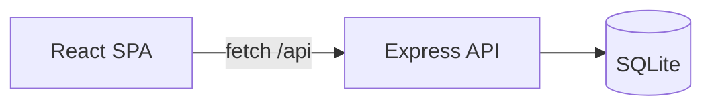

# AI Learning Dashboard / Project Tracker

A full-stack, **frontend-heavy** web application for tracking learning goals, project tasks, ownership, due dates, and progress. Built as an AI-assisted practical assessment demonstrating modern React development, REST API design, SQLite persistence, and comprehensive documentation.

[](https://nodejs.org/)
[](https://react.dev/)
[](https://www.typescriptlang.org/)
[](https://www.sqlite.org/)

---

## Project Overview

The AI Learning Dashboard helps individuals and small teams manage what is **planned**, **in progress**, **completed**, and **overdue** across learning and project work. The dashboard provides real-time summary metrics, searchable task lists with advanced filtering, task detail views with quick status actions, and a full activity audit trail.

| Attribute | Detail |
|-----------|--------|
| **Type** | Full-stack SPA + REST API |
| **Persistence** | SQLite (file-based, survives restarts) |
| **Authentication** | None (assessment scope — public API) |
| **AI Tool** | Built with Cursor IDE (documented workflow) |

---

## Features

### Core (Mandatory)

- **Dashboard** — Five summary cards: total, completed, in-progress, overdue, high-priority
- **Task CRUD** — Create, list, view, and update tasks with full metadata
- **Quick status actions** — Mark tasks in-progress or completed from detail view
- **Search & filter** — Keyword search and status filtering
- **Validation** — Server-side Zod validation with inline field errors
- **UI states** — Loading, empty, error, and success feedback on every page
- **Persistence** — SQLite database with auto-initialization and seed data

### Stretch Goals (Implemented)

- **Activity audit log** — Create, update, and status change history per task
- **Advanced filtering** — Priority, category, owner filters with sorting and pagination
- **Responsive design** — Mobile-friendly layout with CSS breakpoints
- **Accessibility** — Skip link, ARIA labels, keyboard navigation, focus styles
- **Test coverage** — 17 automated tests (API integration + component unit)

### Screenshots

> Placeholder — add screenshots of the dashboard, task list, and task detail views.

| Dashboard | Task List | Task Detail |
|-----------|-----------|-------------|
| _Screenshot placeholder_ | _Screenshot placeholder_ | _Screenshot placeholder_ |

---

## Tech Stack

| Layer | Technology | Purpose |
|-------|------------|---------|
| **Frontend** | React 18, TypeScript, Vite 6 | SPA with HMR |
| **Routing** | React Router 6 | Client-side navigation |
| **Backend** | Node.js, Express 4 | REST API server |
| **Validation** | Zod 3 | Request body validation |
| **Database** | SQLite (better-sqlite3) | File-based persistence |
| **Testing** | Vitest, Supertest, Testing Library | API + component tests |
| **AI Workflow** | Cursor IDE | AI-assisted development |

---

## Folder Structure

```
ai-practical-assessment/
├── src/
│   ├── client/                    # React frontend (Vite root)
│   │   ├── components/            # Reusable UI components
│   │   ├── pages/                 # Route-level page components
│   │   ├── hooks/                 # useAsyncData, useMutation
│   │   ├── services/              # API client (api.ts)
│   │   ├── types/                 # Client types + UI helpers
│   │   └── styles/                # Global CSS
│   ├── server/                    # Express backend
│   │   ├── routes/                # dashboard, tasks, users
│   │   ├── middleware/            # Zod validation middleware
│   │   ├── db.ts                  # SQLite connection + init
│   │   └── validators.ts          # Zod schemas
│   └── shared/
│       └── types.ts               # Shared TypeScript interfaces
├── database/
│   ├── schema-or-migrations/      # SQL schema
│   ├── seed-data/                 # Sample users and tasks
│   └── app.db                     # Runtime database (gitignored)
├── tests/
│   ├── api/                       # API integration tests
│   └── client/                    # Component unit tests
├── docs/                          # Centralized documentation
├── ai-prompts/                    # AI workflow evidence
└── dist/                          # Production build output
```

---

## Installation

### Prerequisites

- **Node.js** 18 or later
- **npm** 9 or later

### Setup

```bash
# Clone the repository
git clone <repository-url>
cd ai-practical-assessment

# Install dependencies
npm install

# Initialize database (optional — auto-runs on first server start)
npm run db:init
```

---

## Environment Variables

| Variable | Default | Description |
|----------|---------|-------------|
| `PORT` | `3001` | Express server port |
| `DATABASE_PATH` | `database/app.db` | SQLite database file path |
| `NODE_ENV` | — | Set to `test` to disable server listen during tests |

**Example:**

```bash
PORT=4000 DATABASE_PATH=./data/tasks.db npm start
```

---

## Running Locally

### Development Mode

Starts Vite dev server (frontend) and Express API concurrently:

```bash
npm run dev
```

| Service | URL |
|---------|-----|
| Frontend | [http://localhost:5173](http://localhost:5173) |
| API | [http://localhost:3001/api](http://localhost:3001/api) |
| Health check | [http://localhost:3001/api/health](http://localhost:3001/api/health) |

Vite proxies `/api` requests to Express automatically.

### Production Build

```bash
# Build client (Vite) and server (TypeScript)
npm run build

# Start production server (serves API + static SPA)
npm start
```

Open [http://localhost:3001](http://localhost:3001) — single process serves both API and frontend.

---

## Testing

```bash
# Run all tests (17 tests: 13 API + 4 component)
npm test

# Watch mode
npm run test:watch

# Type check
npm run lint
```

| Suite | File | Tests |
|-------|------|-------|
| API integration | `tests/api/tasks.test.ts` | 13 |
| Component unit | `tests/client/components.test.tsx` | 4 |

See [docs/testing.md](docs/testing.md) for the full test strategy, validation matrix, and coverage plan.

---

## API Documentation

**Base URL:** `/api`

| Method | Endpoint | Description |
|--------|----------|-------------|
| GET | `/health` | Health check |
| GET | `/dashboard/summary` | Dashboard aggregate counts |
| GET | `/tasks` | List tasks (filter, search, sort, paginate) |
| GET | `/tasks/:id` | Get task by ID |
| POST | `/tasks` | Create task |
| PATCH | `/tasks/:id` | Update task (partial) |
| POST | `/tasks/:id/status` | Quick status change |
| GET | `/tasks/:id/activity` | Task activity audit log |
| GET | `/users` | List seeded users |

**Full reference:** [docs/api.md](docs/api.md) — request/response schemas, validation rules, error codes, and curl examples.

---

## Architecture



| Layer | Documentation |
|-------|---------------|
| System architecture | [docs/architecture.md](docs/architecture.md) |
| Design decisions | [docs/design_decisions.md](docs/design_decisions.md) |
| Database schema | [docs/database.md](docs/database.md) |
| Task status state machine | [docs/state_machine.md](docs/state_machine.md) |

**Pattern:** Layered MVC — React views, Express route handlers, SQLite data store, shared TypeScript types across client and server.

---

## AI Workflow

This project was built using **Cursor IDE** with AI assistance across planning, implementation, testing, debugging, and documentation. Human review was applied to all generated code.

| Document | Description |
|----------|-------------|
| [docs/ai_workflow.md](docs/ai_workflow.md) | End-to-end AI development workflow |
| [docs/prompt_history.md](docs/prompt_history.md) | Chronological prompt evolution |
| [docs/cursor_workflow.md](docs/cursor_workflow.md) | Cursor IDE-specific practices |
| [ai-prompts/](ai-prompts/) | Phase-specific prompt archives |
| [final-ai-usage-summary.md](final-ai-usage-summary.md) | Executive AI usage summary |

**Estimated AI contribution:** 60–70% time savings on scaffolding, documentation, and tests.

---

## Documentation Index

### Requirements & Specifications

| Document | Description |
|----------|-------------|
| [docs/requirements.md](docs/requirements.md) | Project goals, business requirements, constraints |
| [docs/user_stories.md](docs/user_stories.md) | User stories by epic |
| [docs/acceptance_criteria.md](docs/acceptance_criteria.md) | 69 testable acceptance criteria |
| [docs/functional_requirements.md](docs/functional_requirements.md) | Detailed feature specifications |
| [docs/non_functional_requirements.md](docs/non_functional_requirements.md) | Performance, security, maintainability |

### Technical Reference

| Document | Description |
|----------|-------------|
| [docs/architecture.md](docs/architecture.md) | System, frontend, backend architecture |
| [docs/diagrams.md](docs/diagrams.md) | Consolidated Mermaid diagrams |
| [docs/api.md](docs/api.md) | Full REST API reference |
| [docs/database.md](docs/database.md) | Schema, relationships, indexes |
| [docs/state_machine.md](docs/state_machine.md) | Task status transitions |
| [docs/project_flow.md](docs/project_flow.md) | End-to-end project flows |
| [docs/testing.md](docs/testing.md) | Test strategy and coverage plan |
| [docs/design_decisions.md](docs/design_decisions.md) | Technology choices and rationale |
| [docs/adr.md](docs/adr.md) | Architecture Decision Records |

### Assessment Deliverables (Root)

| Document | Description |
|----------|-------------|
| [api-contract.md](api-contract.md) | Original API contract |
| [data-model.md](data-model.md) | Entity definitions |
| [ui-flow.md](ui-flow.md) | User interface flows |
| [test-strategy.md](test-strategy.md) | Testing approach |
| [reflection.md](reflection.md) | Project reflection |

---

## Future Enhancements

| Enhancement | Priority | Notes |
|-------------|----------|-------|
| Authentication (JWT) | High | Required for production deployment |
| React Query / SWR | Medium | Cache invalidation after mutations |
| E2E tests (Playwright) | Medium | Critical user flow automation |
| Combined dashboard query | Low | Single SQL for 5 COUNT queries |
| Dark mode | Low | Theme toggle |
| PostgreSQL migration | Low | For multi-user production scale |
| Rate limiting & request logging | Medium | Production hardening |
| Kanban board view | Low | Drag-and-drop status changes |

---

## Scripts Reference

| Command | Description |
|---------|-------------|
| `npm run dev` | Start dev servers (Vite + Express) |
| `npm run dev:client` | Vite only (:5173) |
| `npm run dev:server` | Express only (:3001) |
| `npm run build` | Build client + server for production |
| `npm start` | Run production server |
| `npm run db:init` | Initialize SQLite schema + seed |
| `npm test` | Run all tests |
| `npm run lint` | TypeScript type check |

---

## License

Assessment project — internal use.

## Final Review

See [FINAL_REVIEW.md](final_review.md) for the complete repository audit, scoring projection, and recommendations.
