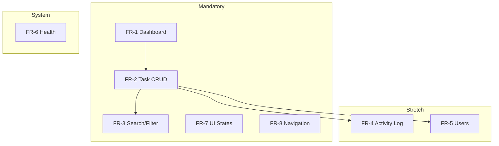

# Functional Requirements — AI Learning Dashboard / Project Tracker

Detailed feature specifications reflecting the **current implementation**.

---

## FR-1: Dashboard

### FR-1.1 Summary Cards

| Attribute | Detail |
|-----------|--------|
| **Endpoint** | `GET /api/dashboard/summary` |
| **Page** | `DashboardPage` (`/`) |
| **Component** | `SummaryCards` |

**Metrics returned:**

| Card | Field | Calculation |
|------|-------|-------------|
| Total Items | `total` | `COUNT(*)` from `project_tasks` |
| Completed | `completed` | `status = 'completed'` |
| In Progress | `inProgress` | `status = 'in_progress'` |
| Overdue | `overdue` | `status != 'completed' AND due_date IS NOT NULL AND due_date < today` |
| High Priority | `highPriority` | `priority = 'high'` (all statuses) |

**Behavior:**
- Cards render immediately after summary API responds
- Values are integers ≥ 0
- No caching — counts computed on every request

### FR-1.2 Recent Tasks Section

| Attribute | Detail |
|-----------|--------|
| **Endpoint** | `GET /api/tasks?limit=5&sortBy=createdAt&sortOrder=desc` |
| **Component** | `TaskList` |

**Behavior:**
- Shows up to 5 most recently created tasks
- "View all tasks →" link navigates to `/tasks`
- Empty state if no tasks exist

---

## FR-2: Task CRUD

### FR-2.1 Create Task

| Attribute | Detail |
|-----------|--------|
| **Route** | `/tasks/new` |
| **Endpoint** | `POST /api/tasks` |
| **Component** | `CreateTaskPage`, `TaskForm` |

**Input fields:**

| Field | Type | Required | Default |
|-------|------|----------|---------|
| title | string | Yes | — |
| description | string | No | `""` |
| category | enum | Yes | `learning` |
| priority | enum | Yes | `medium` |
| status | enum | No | `planned` |
| ownerId | integer | Yes | First user in list |
| dueDate | date (YYYY-MM-DD) | No | empty |

**Success flow:**
1. `POST /api/tasks` returns 201 with created task
2. Activity log entry: `action = 'created'`
3. Green success banner displayed
4. Redirect to `/tasks/:id` after 800ms

**Error flow:**
1. Validation failure → 400 with `details` object
2. Inline field errors rendered in form
3. Non-validation API error → `error-inline` alert above form

### FR-2.2 List Tasks

| Attribute | Detail |
|-----------|--------|
| **Route** | `/tasks` |
| **Endpoint** | `GET /api/tasks` |
| **Components** | `TasksPage`, `TaskFiltersBar`, `TaskList` |

**Query parameters:**

| Param | Type | Default | Description |
|-------|------|---------|-------------|
| status | enum | — | Filter by task status |
| priority | enum | — | Filter by priority |
| category | enum | — | Filter by category |
| ownerId | integer | — | Filter by owner |
| search | string | — | Keyword in title/description |
| sortBy | string | `createdAt` | dueDate, priority, createdAt, title |
| sortOrder | string | `desc` | asc or desc |
| page | integer | 1 | Page number |
| limit | integer | 20 (API) / 10 (UI) | Items per page |

**Response shape:**
```json
{
  "items": [ProjectTask],
  "total": 8,
  "page": 1,
  "limit": 10,
  "totalPages": 1
}
```

**List item display:**
- Title (linked to detail)
- Status badge
- Description preview (120 chars max)
- Priority badge, category badge
- Owner name, due date
- Overdue styling when applicable

### FR-2.3 View Task Detail

| Attribute | Detail |
|-----------|--------|
| **Route** | `/tasks/:id` |
| **Endpoints** | `GET /api/tasks/:id`, `GET /api/tasks/:id/activity` |
| **Component** | `TaskDetailPage`, `TaskDetailView` |

**Displayed sections:**
1. Header: title, status/priority/category/overdue badges, Edit button
2. Description (or "No description provided.")
3. Metadata grid: owner, due date, created, updated
4. Quick status actions
5. Activity history (if entries exist)

### FR-2.4 Update Task

| Attribute | Detail |
|-----------|--------|
| **Route** | `/tasks/:id/edit` |
| **Endpoint** | `PATCH /api/tasks/:id` |
| **Component** | `EditTaskPage`, `TaskForm` |

**Behavior:**
- Form pre-populated from `GET /api/tasks/:id`
- Partial updates accepted (only changed fields sent)
- `updated_at` set to `datetime('now')` on server
- Activity logged: `updated` or `status_changed` if status changed
- Success → banner → redirect to detail after 800ms

### FR-2.5 Quick Status Change

| Attribute | Detail |
|-----------|--------|
| **Route** | `/tasks/:id` (inline) |
| **Endpoint** | `POST /api/tasks/:id/status` |

**Request body:**
```json
{ "status": "in_progress" }
```

**Valid values:** `planned`, `in_progress`, `completed`

**Behavior:**
- Only buttons for non-current statuses shown
- Buttons disabled while request in flight
- On success: success banner, task and activity data reloaded

---

## FR-3: Search and Filtering

### FR-3.1 Keyword Search

- Searches `title` and `description` using SQL `LIKE '%term%'`
- Case-sensitive in SQLite (default collation)
- Client debounces input by 300ms
- Resets pagination to page 1 on change

### FR-3.2 Filter Controls

| Filter | UI Control | Cleared by |
|--------|------------|------------|
| Status | Dropdown with "All statuses" | Selecting empty option |
| Priority | Dropdown with "All priorities" | Selecting empty option |
| Category | Dropdown with "All categories" | Selecting empty option |
| Owner | Dropdown with "All owners" | Selecting empty option |
| Sort | Dropdown: Created, Due Date, Priority, Title | — |
| Order | Dropdown: Descending, Ascending | — |

### FR-3.3 Pagination

- UI uses 10 items per page
- Previous/Next buttons disabled at boundaries
- "Page X of Y" indicator
- Only shown when `totalPages > 1`

---

## FR-4: Activity Log (Stretch)

| Attribute | Detail |
|-----------|--------|
| **Endpoint** | `GET /api/tasks/:id/activity` |
| **Storage** | `activity_logs` table |

**Logged events:**

| Action | Trigger | Details example |
|--------|---------|-----------------|
| `created` | POST /api/tasks | `Task "Title" created` |
| `updated` | PATCH (non-status change) | `Task fields updated` |
| `status_changed` | PATCH or POST status | `Status changed from planned to in_progress` |

**Display:**
- Ordered newest first
- Action name with underscores replaced by spaces
- Optional details text and timestamp

---

## FR-5: Users (Read-Only)

| Attribute | Detail |
|-----------|--------|
| **Endpoint** | `GET /api/users` |
| **Purpose** | Populate owner dropdown in forms and filter bar |

**Seeded users (4):**

| ID | Name | Role |
|----|------|------|
| 1 | Sharda Shukla | admin |
| 2 | Jordan Kim | member |
| 3 | Sam Patel | member |
| 4 | Casey Morgan | viewer |

No create, update, or delete endpoints for users.

---

## FR-6: Health Check

| Attribute | Detail |
|-----------|--------|
| **Endpoint** | `GET /api/health` |
| **Response** | `{ "status": "ok", "timestamp": "<ISO8601>" }` |

Used for deployment health probes (not consumed by frontend).

---

## FR-7: UI State Management

### Loading States

| Page | Trigger | Component |
|------|---------|-----------|
| Dashboard | Summary or recent tasks loading | `LoadingState` |
| Tasks | Task list loading | `LoadingState` |
| Task Detail | Task or activity loading | `LoadingState` |
| Create/Edit | Users or task loading | `LoadingState` |

### Empty States

| Context | Title | Action |
|---------|-------|--------|
| Dashboard (no tasks) | "No tasks yet" | Create Task button |
| Tasks (no results) | "No tasks found" | Create Task or filter hint |

### Error States

| Context | Behavior |
|---------|----------|
| API fetch failure | `ErrorState` with message and retry |
| Form submission failure | Inline alert or field errors |
| Invalid task ID | Static error message |

### Success States

| Context | Behavior |
|---------|----------|
| Create task | Banner → redirect |
| Update task | Banner → redirect |
| Status change | Banner (dismissible) |

---

## FR-8: Navigation

| Route | Page | Nav Link |
|-------|------|----------|
| `/` | Dashboard | Dashboard (active on exact match) |
| `/tasks` | Task List | Tasks |
| `/tasks/new` | Create Task | New Task |
| `/tasks/:id` | Task Detail | — (accessed via list) |
| `/tasks/:id/edit` | Edit Task | — (accessed via detail) |

**Layout features:**
- Header with logo and navigation
- Skip-to-content link for accessibility
- Footer with project attribution
- Active nav state via `aria-current="page"`

---

## Functional Requirements Traceability



---

## Related Documents

- [REQUIREMENTS.md](./REQUIREMENTS.md) — High-level requirements
- [ACCEPTANCE_CRITERIA.md](./ACCEPTANCE_CRITERIA.md) — Testable criteria
- [API.md](./API.md) — Full API reference (Step 6)
