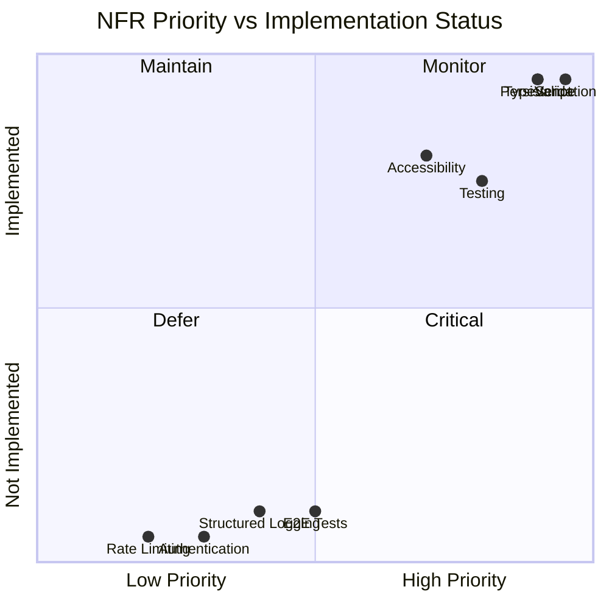

# Non-Functional Requirements — AI Learning Dashboard / Project Tracker

Quality attributes and constraints for the **current implementation**.

---

## NFR-1: Performance

| ID | Requirement | Target | Implementation |
|----|-------------|--------|----------------|
| NFR-1.1 | Dashboard summary response time | < 200ms (local) | Single COUNT queries, no joins |
| NFR-1.2 | Task list response time | < 500ms (local, ≤100 items) | Indexed columns, LIMIT/OFFSET |
| NFR-1.3 | Search debounce | 300ms | Client-side `setTimeout` in `TasksPage` |
| NFR-1.4 | Pagination limit cap | Max 100 per page | Server-side `Math.min(100, ...)` |
| NFR-1.5 | Database journal mode | WAL | `db.pragma('journal_mode = WAL')` |
| NFR-1.6 | Frontend bundle | Vite production build | Code splitting via Vite defaults |

**Not measured:** Load testing, concurrent user benchmarks, CDN delivery.

---

## NFR-2: Reliability & Availability

| ID | Requirement | Implementation |
|----|-------------|----------------|
| NFR-2.1 | Data durability | SQLite file persistence at `database/app.db` |
| NFR-2.2 | Auto-initialization | Schema + seed on first start if tables missing |
| NFR-2.3 | Foreign key integrity | `PRAGMA foreign_keys = ON` |
| NFR-2.4 | Cascade delete on activity | `ON DELETE CASCADE` on `activity_logs.task_id` |
| NFR-2.5 | Graceful API errors | Consistent JSON error format with HTTP status codes |
| NFR-2.6 | Health endpoint | `GET /api/health` for liveness checks |

**Limitations:**
- Single-process SQLite — not suitable for high-concurrency writes
- No automatic backup or replication
- No circuit breaker or retry logic on client (manual retry via UI only)

---

## NFR-3: Security

| ID | Requirement | Status | Notes |
|----|-------------|--------|-------|
| NFR-3.1 | Input validation | ✅ | Zod schemas on all write endpoints |
| NFR-3.2 | SQL injection prevention | ✅ | Parameterized queries via `better-sqlite3` |
| NFR-3.3 | No hardcoded secrets | ✅ | No API keys or credentials in codebase |
| NFR-3.4 | CORS enabled | ✅ | `cors()` middleware (open in dev) |
| NFR-3.5 | Authentication | ❌ Out of scope | All endpoints public |
| NFR-3.6 | Authorization / RBAC | ❌ Out of scope | Roles stored but not enforced |
| NFR-3.7 | Rate limiting | ❌ Not implemented | Acceptable for local assessment |
| NFR-3.8 | HTTPS | ❌ Not enforced | Dev uses HTTP; production deployer's responsibility |
| NFR-3.9 | XSS prevention | ✅ | React auto-escapes; no `dangerouslySetInnerHTML` |

**Security posture:** Suitable for local/trusted development only. Production deployment would require authentication, HTTPS, and rate limiting.

---

## NFR-4: Maintainability

| ID | Requirement | Implementation |
|----|-------------|----------------|
| NFR-4.1 | TypeScript throughout | Client, server, shared, and tests |
| NFR-4.2 | Shared type definitions | `src/shared/types.ts` used by both layers |
| NFR-4.3 | Consistent error format | `{ error, details? }` across all endpoints |
| NFR-4.4 | Validation middleware | Reusable `validateBody()` with Zod |
| NFR-4.5 | Modular route structure | Separate files per resource |
| NFR-4.6 | Custom hooks for async | `useAsyncData`, `useMutation` reduce duplication |
| NFR-4.7 | Label constants | `STATUS_LABELS`, `PRIORITY_LABELS`, `CATEGORY_LABELS` |
| NFR-4.8 | Documentation | `docs/` folder + `ai-prompts/` workflow evidence |

---

## NFR-5: Testability

| ID | Requirement | Implementation |
|----|-------------|----------------|
| NFR-5.1 | API integration tests | Vitest + Supertest in `tests/api/` |
| NFR-5.2 | Component unit tests | Testing Library in `tests/client/` |
| NFR-5.3 | Test database isolation | `DATABASE_PATH` env + `resetDbForTests()` |
| NFR-5.4 | Type checking | `npm run lint` (tsc --noEmit) |
| NFR-5.5 | Test runner stability | `--no-file-parallelism` to avoid worker issues |
| NFR-5.6 | App export for testing | `export default app` from `index.ts` |

**Coverage gaps:**
- No E2E browser tests
- Limited component coverage (forms, pages untested)
- No performance/load tests

---

## NFR-6: Usability & Accessibility

| ID | Requirement | Implementation |
|----|-------------|----------------|
| NFR-6.1 | Responsive layout | CSS media queries in `global.css` |
| NFR-6.2 | Mobile-friendly navigation | Stacked header/nav on small screens |
| NFR-6.3 | Skip-to-content link | Hidden until focused, targets `#main-content` |
| NFR-6.4 | Form labels | All inputs have associated `<label>` elements |
| NFR-6.5 | ARIA attributes | `aria-label`, `aria-current`, `aria-invalid`, `role` |
| NFR-6.6 | Keyboard navigation | Native form controls and buttons |
| NFR-6.7 | Focus styles | CSS focus-visible styles |
| NFR-6.8 | Loading feedback | Spinner with `role="status"` and `aria-live` |
| NFR-6.9 | Error feedback | `role="alert"` on error messages |
| NFR-6.10 | Visual status indicators | Color-coded badges for status, priority, overdue |

**Not verified:** WCAG 2.1 AA audit, screen reader testing matrix.

---

## NFR-7: Scalability

| ID | Requirement | Current State | Production Recommendation |
|----|-------------|---------------|---------------------------|
| NFR-7.1 | Concurrent users | Single SQLite writer | Migrate to PostgreSQL for multi-user |
| NFR-7.2 | Data volume | Suitable for hundreds of tasks | Indexes support growth to thousands |
| NFR-7.3 | Horizontal scaling | Not supported (file-based DB) | External database required |
| NFR-7.4 | Stateless API | ✅ Yes | Ready for load balancer with shared DB |
| NFR-7.5 | Static asset serving | Express serves `dist/client` | CDN recommended for production |

---

## NFR-8: Portability & Deployment

| ID | Requirement | Implementation |
|----|-------------|----------------|
| NFR-8.1 | Node.js runtime | Node 18+ (ES modules) |
| NFR-8.2 | Environment variables | `PORT`, `DATABASE_PATH`, `NODE_ENV` |
| NFR-8.3 | Development mode | Concurrent Vite (:5173) + Express (:3001) with proxy |
| NFR-8.4 | Production mode | Single Express server serves API + built SPA |
| NFR-8.5 | Build pipeline | `npm run build` → `dist/client` + `dist/server` |
| NFR-8.6 | Database path configurable | `DATABASE_PATH` env var |

**Environment variables:**

| Variable | Default | Purpose |
|----------|---------|---------|
| `PORT` | `3001` | Server listen port |
| `DATABASE_PATH` | `database/app.db` | SQLite file location |
| `NODE_ENV` | — | `test` disables server listen |

---

## NFR-9: Compatibility

| ID | Requirement | Target |
|----|-------------|--------|
| NFR-9.1 | Browser support | Chrome, Firefox, Safari, Edge (latest 2 versions) |
| NFR-9.2 | JavaScript modules | ES2020+ (Vite transpilation) |
| NFR-9.3 | API format | JSON over HTTP/REST |
| NFR-9.4 | Date format | ISO 8601 (`YYYY-MM-DD` for dates, datetime strings for timestamps) |

---

## NFR-10: Observability

| ID | Requirement | Implementation |
|----|-------------|----------------|
| NFR-10.1 | Server startup log | `console.log` with port on listen |
| NFR-10.2 | Health check endpoint | `GET /api/health` with timestamp |
| NFR-10.3 | Structured logging | ❌ Not implemented (console only) |
| NFR-10.4 | Error tracking (Sentry, etc.) | ❌ Not implemented |
| NFR-10.5 | Request logging middleware | ❌ Not implemented (morgan, etc.) |

---

## NFR-11: AI Workflow & Documentation

| ID | Requirement | Implementation |
|----|-------------|----------------|
| NFR-11.1 | AI prompt history | `ai-prompts/` folder with phase-specific prompts |
| NFR-11.2 | AI usage summary | `final-ai-usage-summary.md` |
| NFR-11.3 | Requirements documentation | `docs/` folder (this step) |
| NFR-11.4 | Architecture documentation | Planned in Step 4 |
| NFR-11.5 | Human review evidence | `code-review-notes.md`, `review-fixes.md` |

---

## Non-Functional Requirements Summary

---

## Production Readiness Gap Analysis

| Area | Assessment Ready | Production Ready |
|------|-----------------|------------------|
| Core functionality | ✅ | ✅ |
| Data persistence | ✅ | ⚠️ (SQLite limits) |
| Input validation | ✅ | ✅ |
| Error handling | ✅ | ⚠️ (no logging) |
| Authentication | N/A (out of scope) | ❌ Required |
| HTTPS | N/A | ❌ Required |
| Monitoring | N/A | ❌ Required |
| CI/CD | ⚠️ (recommended) | ❌ Required |

---

## Related Documents

- [REQUIREMENTS.md](./REQUIREMENTS.md) — Business and project requirements
- [FUNCTIONAL_REQUIREMENTS.md](./FUNCTIONAL_REQUIREMENTS.md) — Feature specifications
- [TESTING.md](./TESTING.md) — Test strategy (Step 8)
