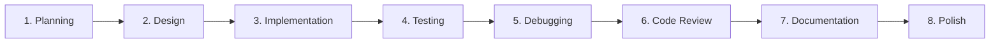
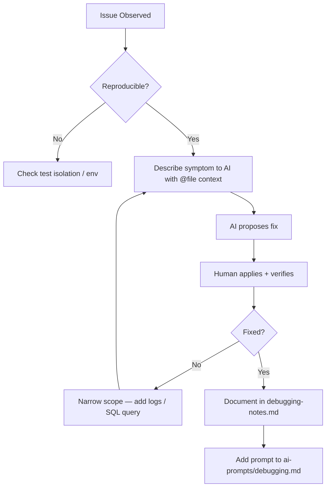

# AI Workflow — AI Learning Dashboard / Project Tracker

## Overview

This project was built using **Cursor IDE** (Auto agent) as the primary AI-assisted development tool. AI contributed across all phases — planning, design, implementation, testing, debugging, code review, and documentation — with **human review of all generated output**.

The workflow followed a **plan-before-code** principle: requirements and API contracts were defined before implementation, reducing rework and keeping frontend/backend aligned.

---

## AI Tool Used

| Tool | Role | Usage |
|------|------|-------|
| **Cursor IDE** | Primary development environment | Agent mode, file referencing, multi-file edits |
| **Cursor Agent (Composer)** | Multi-file scaffolding and implementation | Backend, frontend, tests, docs |
| **Cursor Chat** | Targeted debugging and review | Single-file fixes, SQL queries, config |

No other AI tools (Copilot, ChatGPT standalone, etc.) were used for core development.

---

## Workflow Phases

### Phase 1: Planning

**AI contribution:**
- Analyzed assessment brief (Option 2 — Frontend-Heavy)
- Generated `requirements-analysis.md`, `acceptance-criteria.md`, `implementation-plan.md`
- Defined core entities, mandatory vs stretch features, repository structure

**Human role:**
- Reviewed scope and priorities
- Confirmed SQLite over external database
- Decided to implement stretch goals (activity log, advanced filters)

**Artifacts:** `ai-prompts/planning.md`, `requirements-analysis.md`

---

### Phase 2: Design

**AI contribution:**
- Component hierarchy and UI flow mapping
- API contract definition before any code
- Design system (colors, typography, responsive breakpoints)
- Data model with ER diagram

**Human role:**
- Approved card-based dashboard layout
- Chose debounced search (300ms) over instant filter
- Decided against authentication (out of scope)

**Artifacts:** `ai-prompts/design.md`, `design-notes.md`, `api-contract.md`, `data-model.md`, `ui-flow.md`

---

### Phase 3: Implementation

**AI contribution:**
- Project scaffolding (`package.json`, TypeScript configs, Vite, folder structure)
- SQLite schema, seed data, `db.ts` with auto-initialization
- Express routes (dashboard, tasks, users) with Zod validation
- React pages, components, hooks (`useAsyncData`, `useMutation`)
- Global CSS with design tokens and responsive layout

**Human role:**
- Verified business logic (overdue calculation, dashboard counts)
- Reviewed type safety across `src/shared/types.ts`
- Confirmed API response shapes match contract

**Approach:** Backend-first — schema → API → frontend

**Artifacts:** `ai-prompts/implementation.md`, `src/` codebase

---

### Phase 4: Testing

**AI contribution:**
- Vitest + Supertest API integration tests (12 tests)
- React component tests for SummaryCards and StateMessages
- `test-strategy.md` and `test-results.md`

**Human role:**
- Ran `npm test` and fixed Vitest worker config (`--no-file-parallelism`)
- Verified dashboard count sync test passes after status changes
- Manual UI state testing (loading, empty, error, success)

**Artifacts:** `ai-prompts/testing.md`, `tests/`, `test-strategy.md`

---

### Phase 5: Debugging

**AI contribution:**
- Diagnosed ESM `__dirname` path resolution issues
- Fixed overdue SQL query (exclude completed tasks)
- Configured Vite proxy for `/api` in development
- Test database isolation with `DATABASE_PATH` env var

**Human role:**
- Confirmed fixes in `db.ts` after folder restructure
- Verified overdue count with seed data (task #6)
- Used SQLite CLI for manual data inspection

**Artifacts:** `ai-prompts/debugging.md`, `debugging-notes.md`

---

### Phase 6: Code Review

**AI contribution:**
- Self-review prompt covering security, types, accessibility, performance
- Generated `code-review-notes.md` with severity levels
- Applied fixes documented in `review-fixes.md`

**Human role:**
- Accepted deferred items (auth, rate limiting, E2E tests)
- Verified React XSS safety (auto-escaping)
- Approved accessibility improvements (skip link, ARIA)

**Artifacts:** `ai-prompts/code-review.md`, `code-review-notes.md`, `review-fixes.md`

---

### Phase 7: Documentation

**AI contribution:**
- README, PR description, reflection, final AI usage summary
- 20+ assessment markdown deliverables
- `ai-prompts/` archive with phase-specific prompts
- Cursor workflow documentation

**Human role:**
- Filled `candidate-info.md` with personal details
- Customized test results after running suite
- Reviewed documentation for accuracy against implementation

**Artifacts:** `ai-prompts/documentation.md`, root `*.md` files

---

### Phase 8: Polish (Repository Improvement)

**AI contribution:**
- Centralized `docs/` folder with requirements, architecture, API docs
- Professional README rewrite
- Code quality improvements (comments, constants, dead code removal)
- Architecture diagrams and ADRs

**Human role:**
- Step-by-step approval of each documentation phase
- Confirmed no business logic or API changes

---

## Refactoring Workflow

AI-assisted refactoring followed these rules:

1. **No behavior changes** — Refactors limited to structure, naming, comments
2. **Test-first verification** — Run `npm test` after each refactor batch
3. **Small diffs** — One concern per change (e.g., path fix, then pagination fix)

| Refactor | Trigger | AI Action | Human Verification |
|----------|---------|-----------|-------------------|
| ESM path resolution | `db-init` failed from wrong cwd | `fileURLToPath` pattern | `npm run db:init` |
| Overdue query fix | Count too high | Added `status != 'completed'` | Dashboard API test |
| Pagination reset | Empty page after filter | `useEffect` to reset page | Manual filter test |
| UserRole type cast | TypeScript warning | Explicit cast in mapper | `npm run lint` |
| Database folder paths | Schema moved to subdirs | Updated paths in `db.ts` | Server start + seed load |

---

## Debugging Workflow

**Tools used during debugging:**
- Browser DevTools Network tab
- `console.log` in Express routes
- Vitest verbose output
- SQLite CLI: `sqlite3 database/app.db "SELECT ..."`

---

## Manual Improvements After AI Suggestions

| Area | AI Suggestion | Human Decision |
|------|---------------|----------------|
| Dashboard queries | Single combined COUNT | Kept 5 queries — acceptable for small dataset |
| State management | React Query / SWR | Kept custom hooks — fewer dependencies |
| Authentication | Optional JWT middleware | Rejected — out of assessment scope |
| Vitest parallelism | Default parallel workers | Disabled — `--no-file-parallelism` fixes stack overflow |
| Seed email addresses | Generic placeholders | Updated to assessment-appropriate emails |
| Unused import | `useNavigate` in TaskDetailPage | Removed during review |
| Database path | Relative to cwd | Changed to project-root-relative via `fileURLToPath` |

---

## AI Usage Principles

1. **Plan before code** — Requirements and API contract defined first
2. **Small iterations** — One feature layer at a time, verify, continue
3. **Human review** — All AI code reviewed for logic, security, and style
4. **Document prompts** — Key prompts saved in `ai-prompts/` for reproducibility
5. **Reference existing files** — Use `@file` context instead of re-explaining
6. **Test frequently** — Run `npm test` after each implementation phase
7. **No secrets** — AI never generated or committed credentials

---

## Effectiveness Summary

| Phase | AI Time Saved | Human Oversight Required |
|-------|---------------|--------------------------|
| Planning | ~70% | Scope and priority decisions |
| Design | ~60% | UX and architecture approval |
| Implementation | ~65% | Business logic, type safety |
| Testing | ~75% | Runner config, edge cases |
| Debugging | ~50% | Root cause confirmation |
| Documentation | ~80% | Accuracy review, personal info |
| Code review | ~60% | Severity triage, defer decisions |

**Overall estimate:** AI accelerated delivery by **60–70%** compared to fully manual development.

---

## Evidence Locations

| Evidence Type | Location |
|---------------|----------|
| Phase prompts | `ai-prompts/planning.md` through `documentation.md` |
| Cursor-specific workflow | `ai-prompts/tool-specific/cursor-workflow/` |
| Usage summary | `final-ai-usage-summary.md` |
| Debugging log | `debugging-notes.md` |
| Review findings | `code-review-notes.md`, `review-fixes.md` |
| Reflection | `reflection.md` |
| Consolidated docs | `docs/` folder |

---

## Related Documents

- [prompt_history.md](./prompt_history.md) — Chronological prompt evolution
- [design_decisions.md](./design_decisions.md) — Architecture and technology choices
- [cursor_workflow.md](./cursor_workflow.md) — Cursor IDE-specific practices
