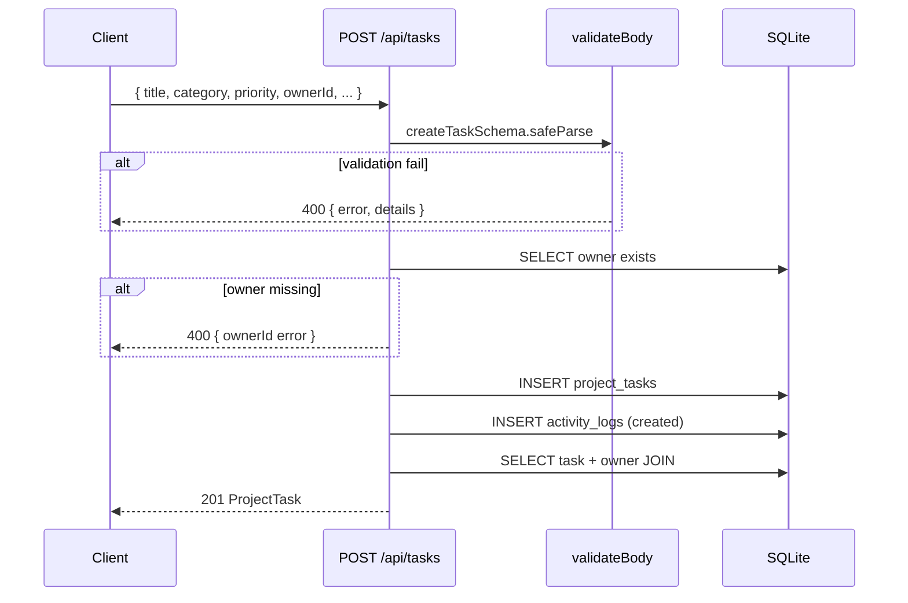
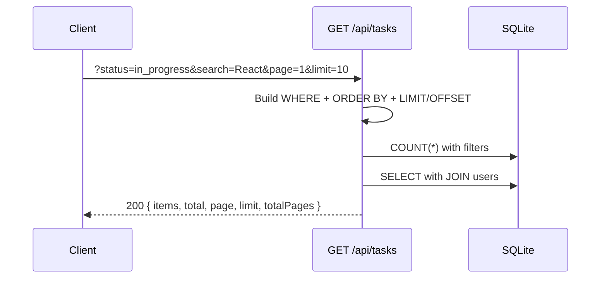

# API Reference — AI Learning Dashboard / Project Tracker

Complete REST API documentation for the **current implementation**.

---

## General Information

| Property | Value |
|----------|-------|
| **Base URL (dev)** | `http://localhost:3001/api` |
| **Base URL (dev via Vite)** | `http://localhost:5173/api` (proxied to :3001) |
| **Base URL (production)** | `/api` (same origin as SPA) |
| **Content-Type** | `application/json` |
| **Authentication** | None (all endpoints public) |

### Standard Headers

**Request:**
```
Content-Type: application/json
```

**Response:**
```
Content-Type: application/json; charset=utf-8
```

### Error Response Format

All error responses follow this structure:

```json
{
  "error": "Human-readable error message",
  "details": {
    "fieldName": ["Specific validation message"]
  }
}
```

| Field | Type | Required | Description |
|-------|------|----------|-------------|
| `error` | string | Yes | Summary error message |
| `details` | `Record<string, string[]>` | No | Field-level validation errors |

### HTTP Status Codes Used

| Code | Meaning | When Used |
|------|---------|-----------|
| `200` | OK | Successful GET, PATCH, POST status |
| `201` | Created | Successful POST create |
| `400` | Bad Request | Validation failure, invalid ID, empty PATCH body |
| `404` | Not Found | Task or route not found |
| `500` | Internal Server Error | Unhandled server error (rare) |

---

## Data Types

### User

```typescript
{
  id: number;
  name: string;
  email: string;
  role: "admin" | "member" | "viewer";
}
```

### ProjectTask

```typescript
{
  id: number;
  title: string;
  description: string;
  category: "learning" | "project" | "research" | "practice";
  priority: "low" | "medium" | "high";
  status: "planned" | "in_progress" | "completed";
  ownerId: number;
  dueDate: string | null;        // "YYYY-MM-DD" or null
  createdAt: string;               // "YYYY-MM-DD HH:MM:SS"
  updatedAt: string;               // "YYYY-MM-DD HH:MM:SS"
  owner?: User;                    // Included when joined from users table
}
```

### ActivityLog

```typescript
{
  id: number;
  taskId: number;
  action: string;                  // "created" | "updated" | "status_changed"
  details: string | null;
  createdAt: string;
}
```

### DashboardSummary

```typescript
{
  total: number;
  completed: number;
  inProgress: number;
  overdue: number;
  highPriority: number;
}
```

### PaginatedTasks

```typescript
{
  items: ProjectTask[];
  total: number;
  page: number;
  limit: number;
  totalPages: number;
}
```

---

## Endpoint Index

| Method | Endpoint | Description |
|--------|----------|-------------|
| GET | `/api/health` | Health check |
| GET | `/api/dashboard/summary` | Dashboard aggregate counts |
| GET | `/api/tasks` | List tasks (filter, search, paginate) |
| GET | `/api/tasks/:id` | Get task by ID |
| POST | `/api/tasks` | Create task |
| PATCH | `/api/tasks/:id` | Update task (partial) |
| POST | `/api/tasks/:id/status` | Quick status change |
| GET | `/api/tasks/:id/activity` | Get task activity log |
| GET | `/api/users` | List seeded users |

---

## Health

### GET /api/health

Liveness check for deployment monitoring.

| Property | Value |
|----------|-------|
| **Method** | `GET` |
| **Auth** | None |
| **Request body** | None |

#### Response 200

```json
{
  "status": "ok",
  "timestamp": "2026-07-20T09:15:30.123Z"
}
```

| Field | Type | Description |
|-------|------|-------------|
| `status` | string | Always `"ok"` when server is running |
| `timestamp` | string | ISO 8601 UTC timestamp |

#### Example

```bash
curl http://localhost:3001/api/health
```

---

## Dashboard

### GET /api/dashboard/summary

Returns aggregate counts for the five dashboard summary cards.

| Property | Value |
|----------|-------|
| **Method** | `GET` |
| **Auth** | None |
| **Request body** | None |
| **Query params** | None |

#### Count Logic

| Field | SQL Logic |
|-------|-----------|
| `total` | `COUNT(*)` from `project_tasks` |
| `completed` | `status = 'completed'` |
| `inProgress` | `status = 'in_progress'` |
| `overdue` | `status != 'completed' AND due_date IS NOT NULL AND due_date < today` |
| `highPriority` | `priority = 'high'` (all statuses) |

#### Response 200

```json
{
  "total": 8,
  "completed": 2,
  "inProgress": 3,
  "overdue": 1,
  "highPriority": 3
}
```

#### Example

```bash
curl http://localhost:3001/api/dashboard/summary
```

#### Error Responses

| Status | Condition | Response |
|--------|-----------|----------|
| 500 | Database error | `{ "error": "..." }` |

---

## Tasks

### GET /api/tasks

List tasks with optional filtering, search, sorting, and pagination.

| Property | Value |
|----------|-------|
| **Method** | `GET` |
| **Auth** | None |
| **Request body** | None |

#### Query Parameters

| Param | Type | Default | Description |
|-------|------|---------|-------------|
| `status` | string | — | Filter: `planned`, `in_progress`, `completed` |
| `priority` | string | — | Filter: `low`, `medium`, `high` |
| `category` | string | — | Filter: `learning`, `project`, `research`, `practice` |
| `ownerId` | number | — | Filter by owner user ID |
| `search` | string | — | Keyword search in `title` and `description` (LIKE `%term%`) |
| `sortBy` | string | `createdAt` | Sort field: `dueDate`, `priority`, `createdAt`, `title` |
| `sortOrder` | string | `desc` | Sort direction: `asc` or `desc` |
| `page` | number | `1` | Page number (minimum 1) |
| `limit` | number | `20` | Items per page (1–100) |

#### Validation

| Param | Invalid Value Behavior |
|-------|------------------------|
| `page` | Non-numeric or < 1 → defaults to 1 |
| `limit` | Non-numeric, < 1, or > 100 → clamped to 1–100 |
| `sortBy` | Unknown value → defaults to `created_at` |
| `sortOrder` | Non-`asc` → defaults to `DESC` |
| `status`, `priority`, `category` | Invalid values return empty results (no 400) |

#### Response 200

```json
{
  "items": [
    {
      "id": 1,
      "title": "Complete React Hooks deep-dive",
      "description": "Study useEffect, useMemo, useCallback, and custom hooks with practical exercises.",
      "category": "learning",
      "priority": "high",
      "status": "in_progress",
      "ownerId": 1,
      "dueDate": "2026-07-15",
      "createdAt": "2026-06-20 10:00:00",
      "updatedAt": "2026-07-01 14:30:00",
      "owner": {
        "id": 1,
        "name": "Sharda Shukla",
        "email": "sharda.shukla@tothenew.com",
        "role": "admin"
      }
    }
  ],
  "total": 8,
  "page": 1,
  "limit": 20,
  "totalPages": 1
}
```

#### Examples

```bash
# All tasks
curl "http://localhost:3001/api/tasks"

# Filter by status
curl "http://localhost:3001/api/tasks?status=completed"

# Search + paginate
curl "http://localhost:3001/api/tasks?search=React&page=1&limit=10"

# Sort by due date ascending
curl "http://localhost:3001/api/tasks?sortBy=dueDate&sortOrder=asc"

# Multiple filters
curl "http://localhost:3001/api/tasks?priority=high&category=learning&ownerId=1"
```

---

### GET /api/tasks/:id

Get a single task by ID with owner details.

| Property | Value |
|----------|-------|
| **Method** | `GET` |
| **Auth** | None |
| **URL params** | `id` — integer task ID |

#### Validation

| Condition | Status | Response |
|-----------|--------|----------|
| `id` is not a number | 400 | `{ "error": "Invalid task ID" }` |
| Task does not exist | 404 | `{ "error": "Task not found" }` |

#### Response 200

```json
{
  "id": 1,
  "title": "Complete React Hooks deep-dive",
  "description": "Study useEffect, useMemo, useCallback, and custom hooks with practical exercises.",
  "category": "learning",
  "priority": "high",
  "status": "in_progress",
  "ownerId": 1,
  "dueDate": "2026-07-15",
  "createdAt": "2026-06-20 10:00:00",
  "updatedAt": "2026-07-01 14:30:00",
  "owner": {
    "id": 1,
    "name": "Sharda Shukla",
    "email": "sharda.shukla@tothenew.com",
    "role": "admin"
  }
}
```

#### Examples

```bash
# Get task by ID
curl http://localhost:3001/api/tasks/1

# Invalid ID
curl http://localhost:3001/api/tasks/abc
# → 400 { "error": "Invalid task ID" }

# Not found
curl http://localhost:3001/api/tasks/99999
# → 404 { "error": "Task not found" }
```

---

### POST /api/tasks

Create a new task.

| Property | Value |
|----------|-------|
| **Method** | `POST` |
| **Auth** | None |
| **Content-Type** | `application/json` |

#### Request Body

| Field | Type | Required | Default | Validation |
|-------|------|----------|---------|------------|
| `title` | string | **Yes** | — | 1–200 characters |
| `description` | string | No | `""` | Max 2000 characters |
| `category` | enum | **Yes** | — | `learning`, `project`, `research`, `practice` |
| `priority` | enum | **Yes** | — | `low`, `medium`, `high` |
| `status` | enum | No | `planned` | `planned`, `in_progress`, `completed` |
| `ownerId` | number | **Yes** | — | Positive integer; must exist in `users` |
| `dueDate` | string \| null | No | `null` | ISO date `YYYY-MM-DD` or null |

#### Example Request

```json
{
  "title": "New learning goal",
  "description": "Optional description of the task",
  "category": "learning",
  "priority": "medium",
  "status": "planned",
  "ownerId": 1,
  "dueDate": "2026-08-01"
}
```

#### Response 201

Returns the created task object (same shape as GET /tasks/:id).

```json
{
  "id": 9,
  "title": "New learning goal",
  "description": "Optional description of the task",
  "category": "learning",
  "priority": "medium",
  "status": "planned",
  "ownerId": 1,
  "dueDate": "2026-08-01",
  "createdAt": "2026-07-20 09:30:00",
  "updatedAt": "2026-07-20 09:30:00",
  "owner": {
    "id": 1,
    "name": "Sharda Shukla",
    "email": "sharda.shukla@tothenew.com",
    "role": "admin"
  }
}
```

#### Side Effects

- Inserts row into `project_tasks`
- Creates activity log: `action = 'created'`, `details = 'Task "..." created'`

#### Error Responses

| Status | Condition | Example Response |
|--------|-----------|------------------|
| 400 | Missing title | `{ "error": "Validation failed", "details": { "title": ["Title is required"] } }` |
| 400 | Invalid category | `{ "error": "Validation failed", "details": { "category": ["Invalid enum value..."] } }` |
| 400 | Owner does not exist | `{ "error": "Validation failed", "details": { "ownerId": ["Owner does not exist"] } }` |
| 400 | Title too long | `{ "error": "Validation failed", "details": { "title": ["Title must be 200 characters or less"] } }` |

#### Examples

```bash
# Create task
curl -X POST http://localhost:3001/api/tasks \
  -H "Content-Type: application/json" \
  -d '{
    "title": "Test Task",
    "description": "A test task",
    "category": "learning",
    "priority": "medium",
    "ownerId": 1,
    "dueDate": "2026-08-01"
  }'

# Missing title (400)
curl -X POST http://localhost:3001/api/tasks \
  -H "Content-Type: application/json" \
  -d '{ "category": "learning", "priority": "medium", "ownerId": 1 }'
```

---

### PATCH /api/tasks/:id

Update one or more fields on an existing task. Send only fields to change.

| Property | Value |
|----------|-------|
| **Method** | `PATCH` |
| **Auth** | None |
| **URL params** | `id` — integer task ID |
| **Content-Type** | `application/json` |

#### Request Body

All fields optional (partial update):

| Field | Type | Validation |
|-------|------|------------|
| `title` | string | 1–200 characters |
| `description` | string | Max 2000 characters |
| `category` | enum | `learning`, `project`, `research`, `practice` |
| `priority` | enum | `low`, `medium`, `high` |
| `status` | enum | `planned`, `in_progress`, `completed` |
| `ownerId` | number | Positive integer; must exist in `users` |
| `dueDate` | string \| null | ISO date or null |

#### Example Request

```json
{
  "title": "Updated Title",
  "priority": "high"
}
```

#### Response 200

Returns the updated task object.

```json
{
  "id": 3,
  "title": "Updated Title",
  "description": "Work through advanced generic patterns and utility types.",
  "category": "practice",
  "priority": "high",
  "status": "planned",
  "ownerId": 3,
  "dueDate": "2026-07-20",
  "createdAt": "2026-07-01 11:00:00",
  "updatedAt": "2026-07-20 10:00:00",
  "owner": {
    "id": 3,
    "name": "Sam Patel",
    "email": "sam.patel@example.com",
    "role": "member"
  }
}
```

#### Side Effects

- Updates `updated_at` to current timestamp
- If `status` changed: activity log `status_changed` with from/to details
- Otherwise: activity log `updated` with `"Task fields updated"`

#### Error Responses

| Status | Condition | Response |
|--------|-----------|----------|
| 400 | Invalid task ID | `{ "error": "Invalid task ID" }` |
| 400 | Empty body (no fields) | `{ "error": "No fields to update" }` |
| 400 | Validation failure | `{ "error": "Validation failed", "details": { ... } }` |
| 400 | Owner does not exist | `{ "error": "Validation failed", "details": { "ownerId": ["Owner does not exist"] } }` |
| 404 | Task not found | `{ "error": "Task not found" }` |

#### Examples

```bash
# Update title and priority
curl -X PATCH http://localhost:3001/api/tasks/3 \
  -H "Content-Type: application/json" \
  -d '{ "title": "Updated Title", "priority": "high" }'

# Empty body (400)
curl -X PATCH http://localhost:3001/api/tasks/3 \
  -H "Content-Type: application/json" \
  -d '{}'
```

---

### POST /api/tasks/:id/status

Quick status change without sending the full task body.

| Property | Value |
|----------|-------|
| **Method** | `POST` |
| **Auth** | None |
| **URL params** | `id` — integer task ID |
| **Content-Type** | `application/json` |

#### Request Body

| Field | Type | Required | Validation |
|-------|------|----------|------------|
| `status` | enum | **Yes** | `planned`, `in_progress`, `completed` |

#### Example Request

```json
{
  "status": "in_progress"
}
```

#### Response 200

Returns the updated task object with new status.

```json
{
  "id": 1,
  "title": "Complete React Hooks deep-dive",
  "description": "Study useEffect, useMemo, useCallback, and custom hooks with practical exercises.",
  "category": "learning",
  "priority": "high",
  "status": "in_progress",
  "ownerId": 1,
  "dueDate": "2026-07-15",
  "createdAt": "2026-06-20 10:00:00",
  "updatedAt": "2026-07-20 10:15:00",
  "owner": {
    "id": 1,
    "name": "Sharda Shukla",
    "email": "sharda.shukla@tothenew.com",
    "role": "admin"
  }
}
```

#### Side Effects

- Updates `status` and `updated_at`
- Activity log: `status_changed` with `"Status changed from {old} to {new}"`
- Dashboard counts affected on next summary fetch

#### Transition Rules

All transitions between `planned`, `in_progress`, and `completed` are allowed. No transition guards.

#### Error Responses

| Status | Condition | Response |
|--------|-----------|----------|
| 400 | Invalid status value | `{ "error": "Invalid status. Must be planned, in_progress, or completed." }` |
| 400 | Missing status in body | `{ "error": "Invalid status. Must be planned, in_progress, or completed." }` |
| 404 | Task not found | `{ "error": "Task not found" }` |

#### Examples

```bash
# Mark in progress
curl -X POST http://localhost:3001/api/tasks/1/status \
  -H "Content-Type: application/json" \
  -d '{ "status": "in_progress" }'

# Mark completed
curl -X POST http://localhost:3001/api/tasks/1/status \
  -H "Content-Type: application/json" \
  -d '{ "status": "completed" }'

# Invalid status (400)
curl -X POST http://localhost:3001/api/tasks/1/status \
  -H "Content-Type: application/json" \
  -d '{ "status": "cancelled" }'
```

---

### GET /api/tasks/:id/activity

Get the activity audit log for a task, ordered newest first.

| Property | Value |
|----------|-------|
| **Method** | `GET` |
| **Auth** | None |
| **URL params** | `id` — integer task ID |

#### Validation

| Condition | Status | Response |
|-----------|--------|----------|
| `id` is not a number | 400 | `{ "error": "Invalid task ID" }` |
| Task does not exist | 404 | `{ "error": "Task not found" }` |

#### Response 200

```json
[
  {
    "id": 2,
    "taskId": 1,
    "action": "status_changed",
    "details": "Status changed from planned to in_progress",
    "createdAt": "2026-07-01 14:30:00"
  },
  {
    "id": 1,
    "taskId": 1,
    "action": "created",
    "details": "Task created with status planned",
    "createdAt": "2026-06-20 10:00:00"
  }
]
```

Returns empty array `[]` if no activity entries exist (but task must exist).

#### Activity Action Types

| Action | Trigger |
|--------|---------|
| `created` | `POST /api/tasks` |
| `updated` | `PATCH /api/tasks/:id` (non-status change) |
| `status_changed` | `PATCH` or `POST /status` when status differs |

#### Examples

```bash
curl http://localhost:3001/api/tasks/1/activity
```

---

## Users

### GET /api/users

Returns all seeded users for owner dropdown and filter controls. Sorted by name ascending.

| Property | Value |
|----------|-------|
| **Method** | `GET` |
| **Auth** | None |
| **Request body** | None |
| **Query params** | None |

#### Response 200

```json
[
  {
    "id": 4,
    "name": "Casey Morgan",
    "email": "casey.morgan@example.com",
    "role": "viewer"
  },
  {
    "id": 2,
    "name": "Jordan Kim",
    "email": "jordan.kim@example.com",
    "role": "member"
  },
  {
    "id": 3,
    "name": "Sam Patel",
    "email": "sam.patel@example.com",
    "role": "member"
  },
  {
    "id": 1,
    "name": "Sharda Shukla",
    "email": "sharda.shukla@tothenew.com",
    "role": "admin"
  }
]
```

#### Notes

- Users are **read-only** — no create, update, or delete endpoints
- Roles (`admin`, `member`, `viewer`) are stored but **not enforced**
- 4 seeded users loaded from `database/seed-data/seed-data.sql`

#### Example

```bash
curl http://localhost:3001/api/users
```

---

## API Flow Diagrams

### Create Task Flow



### Task List with Filters Flow



---

## Validation Reference

### Zod Schemas (Server)

**Create (`createTaskSchema`):**

```typescript
{
  title: string.min(1).max(200),           // required
  description: string.max(2000).default(""),
  category: enum["learning","project","research","practice"],  // required
  priority: enum["low","medium","high"],     // required
  status: enum["planned","in_progress","completed"].default("planned"),
  ownerId: number.int().positive(),          // required
  dueDate: string.nullable().optional()
}
```

**Update (`updateTaskSchema`):**

```typescript
{
  title: string.min(1).max(200).optional(),
  description: string.max(2000).optional(),
  category: enum.optional(),
  priority: enum.optional(),
  status: enum.optional(),
  ownerId: number.int().positive().optional(),
  dueDate: string.nullable().optional()
}
```

### Custom Validation (Route Handlers)

| Check | Endpoint | Error |
|-------|----------|-------|
| Task ID is integer | GET/PATCH/POST `/:id` | 400 Invalid task ID |
| Task exists | GET/PATCH/POST `/:id` | 404 Task not found |
| Owner exists | POST, PATCH (if ownerId) | 400 Owner does not exist |
| Body not empty | PATCH | 400 No fields to update |
| Status in enum | POST `/:id/status` | 400 Invalid status |

---

## Client API Service

The frontend consumes these endpoints via `src/client/services/api.ts`:

| Method | Function | Endpoint |
|--------|----------|----------|
| `api.getDashboardSummary()` | GET | `/api/dashboard/summary` |
| `api.getUsers()` | GET | `/api/users` |
| `api.getTasks(filters)` | GET | `/api/tasks?...` |
| `api.getTask(id)` | GET | `/api/tasks/:id` |
| `api.getTaskActivity(id)` | GET | `/api/tasks/:id/activity` |
| `api.createTask(data)` | POST | `/api/tasks` |
| `api.updateTask(id, data)` | PATCH | `/api/tasks/:id` |
| `api.updateTaskStatus(id, status)` | POST | `/api/tasks/:id/status` |

Errors are thrown as `ApiRequestError` with `message`, `status`, and optional `details`.

---

## Error Code Quick Reference

| Endpoint | 200 | 201 | 400 | 404 |
|----------|-----|-----|-----|-----|
| GET /health | ✅ | — | — | — |
| GET /dashboard/summary | ✅ | — | — | — |
| GET /tasks | ✅ | — | — | — |
| GET /tasks/:id | ✅ | — | ✅ invalid ID | ✅ not found |
| POST /tasks | — | ✅ | ✅ validation | — |
| PATCH /tasks/:id | ✅ | — | ✅ validation/empty | ✅ not found |
| POST /tasks/:id/status | ✅ | — | ✅ invalid status | ✅ not found |
| GET /tasks/:id/activity | ✅ | — | ✅ invalid ID | ✅ not found |
| GET /users | ✅ | — | — | — |
| Unknown /api/* | — | — | — | ✅ Not found |

---

## Related Documents

- [ARCHITECTURE.md](./ARCHITECTURE.md) — API layer architecture
- [STATE_MACHINE.md](./STATE_MACHINE.md) — Status transition rules
- [DATABASE.md](./DATABASE.md) — Database schema (Step 7)
- [FUNCTIONAL_REQUIREMENTS.md](./FUNCTIONAL_REQUIREMENTS.md) — Feature specifications
- `api-contract.md` — Original API contract (repository root)
