# Architecture — AI Learning Dashboard / Project Tracker

System architecture documentation reflecting the **current implementation**.

---

## High-Level Architecture

The application is a **monorepo full-stack SPA** with a React frontend, Express REST API, and SQLite persistence. In development, Vite serves the frontend with an API proxy; in production, Express serves both the built SPA and API from a single port.

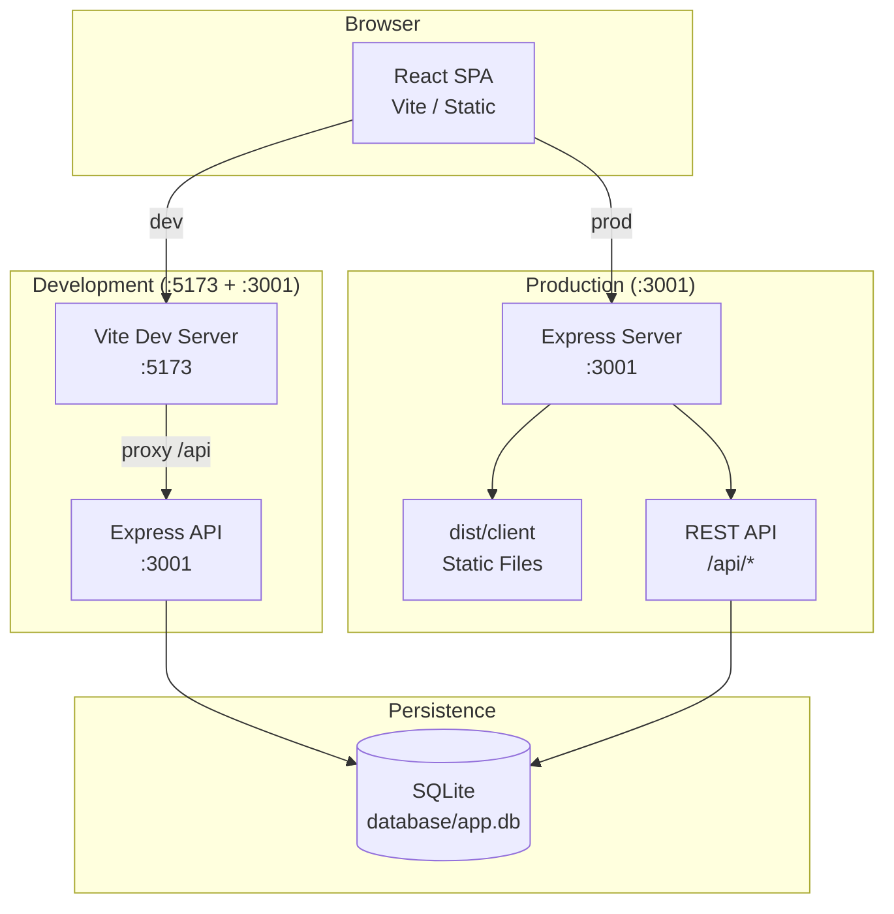

### Architecture Characteristics

| Attribute | Value |
|-----------|-------|
| Pattern | Layered MVC (Model-View-Controller) |
| Communication | REST JSON over HTTP |
| Auth | None (public API) |
| State | Server: stateless; Client: local hooks per page |
| Deployment unit | Single Node.js process |

---

## System Layers

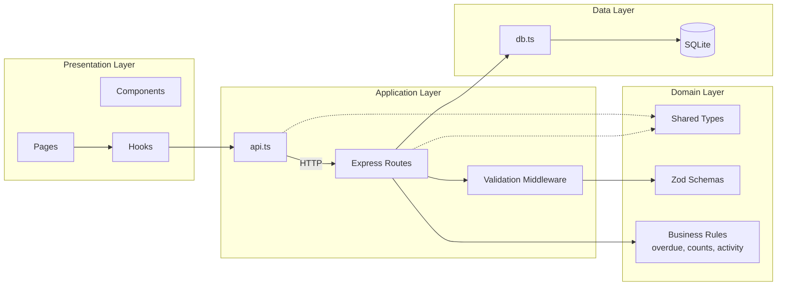

---

## Frontend Architecture

### Technology Stack

| Component | Technology |
|-----------|------------|
| Framework | React 18 |
| Language | TypeScript |
| Build | Vite 6 |
| Routing | React Router 6 |
| Styling | Global CSS (design tokens) |
| HTTP | Native `fetch` via `api.ts` |
| State | Custom hooks (`useAsyncData`, `useMutation`) |

### Frontend Layer Diagram

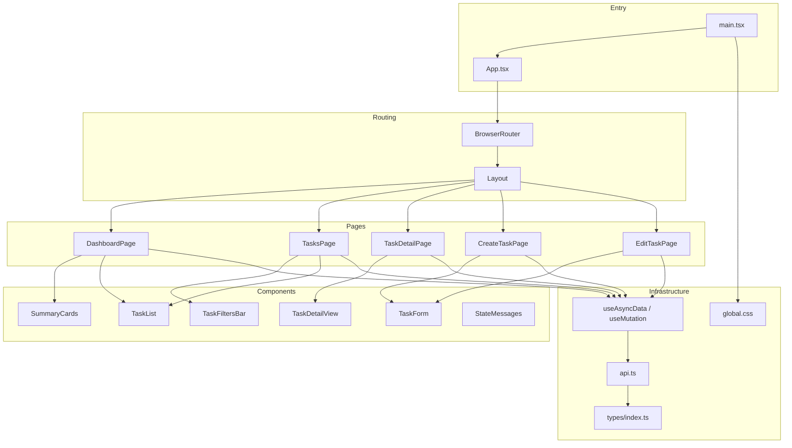

### Component Hierarchy

```
App
└── BrowserRouter
    └── Routes
        └── Layout (header, nav, footer, Outlet)
            ├── DashboardPage (/)
            │   ├── SummaryCards
            │   ├── TaskList (recent, limit=5)
            │   └── StateMessages (Loading, Empty, Error)
            │
            ├── TasksPage (/tasks)
            │   ├── TaskFiltersBar
            │   ├── TaskList (paginated)
            │   ├── Pagination controls
            │   └── StateMessages
            │
            ├── TaskDetailPage (/tasks/:id)
            │   ├── TaskDetailView
            │   │   ├── Status badges
            │   │   ├── Quick action buttons
            │   │   └── Activity log
            │   └── StateMessages (Success, Error)
            │
            ├── CreateTaskPage (/tasks/new)
            │   ├── TaskForm
            │   └── StateMessages
            │
            └── EditTaskPage (/tasks/:id/edit)
                ├── TaskForm (pre-populated)
                └── StateMessages
```

### Page Responsibilities

| Page | Data Fetched | User Actions |
|------|-------------|--------------|
| `DashboardPage` | Summary + recent tasks (5) | Navigate to tasks, create task |
| `TasksPage` | Paginated tasks + users | Search, filter, sort, paginate |
| `TaskDetailPage` | Task + activity log | Quick status change, edit |
| `CreateTaskPage` | Users list | Submit new task form |
| `EditTaskPage` | Task + users list | Submit updated task form |

### State Management Pattern

No global state library. Each page manages its own data lifecycle:

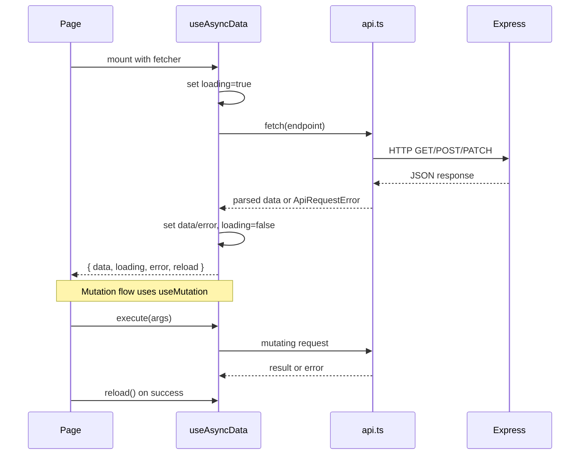

**Key hooks:**

| Hook | Purpose | Returns |
|------|---------|---------|
| `useAsyncData(fetcher, deps)` | Read operations | `{ data, loading, error, validationErrors, reload }` |
| `useMutation(mutator)` | Write operations | `{ execute, loading, error, validationErrors, success, reset }` |

### Client Error Handling

```
fetch response
    ├── ok → parse JSON → return data
    └── !ok → parse error body → throw ApiRequestError(message, status, details)
                                              ↓
                              Hook catches → sets error / validationErrors
                                              ↓
                              UI renders ErrorState / field errors / error-inline
```

---

## Backend Architecture

### Technology Stack

| Component | Technology |
|-----------|------------|
| Runtime | Node.js (ES modules) |
| Framework | Express 4 |
| Database driver | better-sqlite3 (synchronous) |
| Validation | Zod 3 |
| CORS | cors middleware |

### Backend Layer Diagram

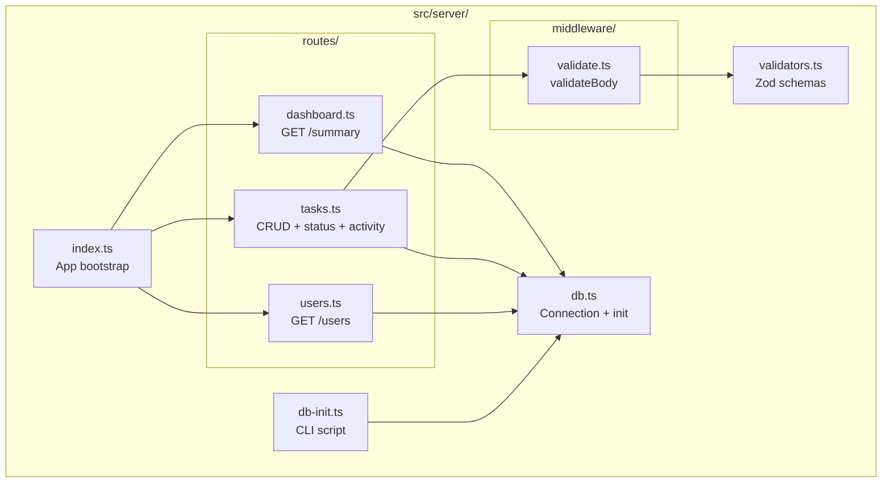

### Request Processing Pipeline

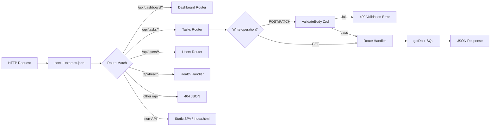

### Route Handler Responsibilities

| Router | Endpoints | Key Logic |
|--------|-----------|-----------|
| `dashboard.ts` | `GET /summary` | 5 COUNT queries for metrics |
| `tasks.ts` | CRUD + status + activity | Filtering, pagination, activity logging, owner join |
| `users.ts` | `GET /` | Read seeded users for dropdowns |

### Business Logic Location

Business rules are implemented directly in route handlers:

| Rule | Location | Implementation |
|------|----------|----------------|
| Overdue count | `dashboard.ts` | `status != 'completed' AND due_date < today` |
| Activity logging | `tasks.ts` | `logActivity()` on create/update/status |
| Owner validation | `tasks.ts` | `SELECT id FROM users WHERE id = ?` |
| Priority sort | `tasks.ts` | SQL `CASE` expression for high/medium/low |
| Pagination bounds | `tasks.ts` | `page >= 1`, `limit <= 100` |

---

## API Layer

### Endpoint Map

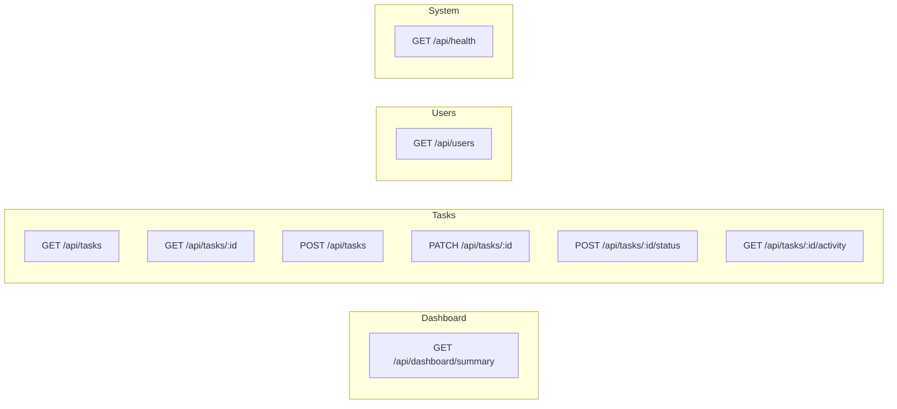

### API Design Principles

1. **JSON only** — All request/response bodies are `application/json`
2. **Consistent errors** — `{ error: string, details?: Record<string, string[]> }`
3. **Owner embedding** — Task responses include `owner` object (JOIN, not separate fetch)
4. **Pagination envelope** — List responses wrap items in `{ items, total, page, limit, totalPages }`
5. **Partial updates** — PATCH accepts only changed fields
6. **Intent-revealing endpoints** — `POST /tasks/:id/status` for quick status changes

### API Flow — Create Task

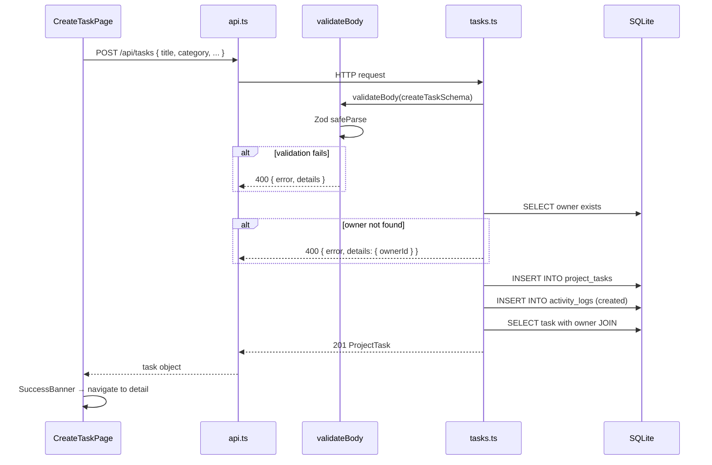

### API Flow — List with Filters

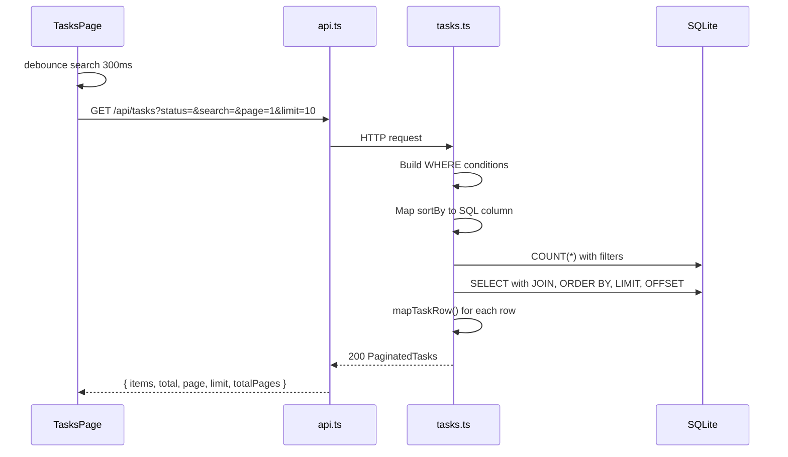

---

## Database Layer

### Entity Relationship Diagram

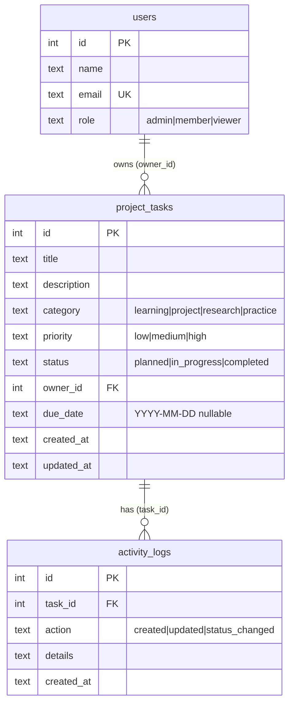

### Database Configuration

| Setting | Value | Purpose |
|---------|-------|---------|
| Engine | SQLite 3 | File-based persistence |
| Driver | better-sqlite3 | Synchronous Node.js binding |
| Journal mode | WAL | Concurrent reads during writes |
| Foreign keys | ON | Referential integrity |
| Default path | `database/app.db` | Overridable via `DATABASE_PATH` |
| Init strategy | Auto on first start | Schema + seed if `users` table missing |

### Initialization Flow

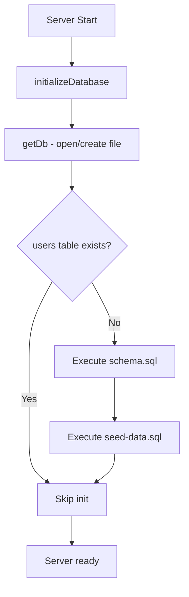

### Indexes

| Index | Column | Purpose |
|-------|--------|---------|
| `idx_tasks_status` | `project_tasks.status` | Status filter |
| `idx_tasks_owner` | `project_tasks.owner_id` | Owner filter |
| `idx_tasks_priority` | `project_tasks.priority` | Priority filter |
| `idx_tasks_category` | `project_tasks.category` | Category filter |
| `idx_tasks_due_date` | `project_tasks.due_date` | Due date sort/filter |
| `idx_activity_task` | `activity_logs.task_id` | Activity lookup |

### Data Access Pattern

```typescript
// Synchronous pattern throughout
const db = getDb();
const row = db.prepare('SELECT ... WHERE id = ?').get(id);
const rows = db.prepare('SELECT ...').all(...params);
const result = db.prepare('INSERT ...').run(...values);
```

No ORM, no query builder — raw parameterized SQL for clarity and control.

---

## Shared Layer

`src/shared/types.ts` is the **contract between frontend and backend**:

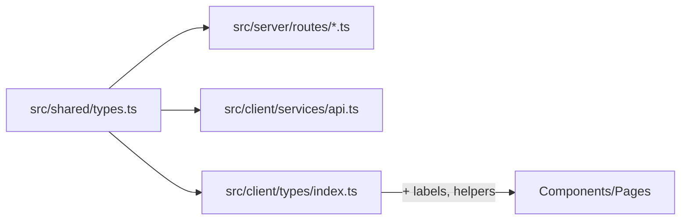

**Shared interfaces:** `User`, `ProjectTask`, `DashboardSummary`, `ActivityLog`, `TaskFilters`, `PaginatedTasks`, `CreateTaskInput`, `UpdateTaskInput`, `ApiError`

**Client-only additions** (`src/client/types/index.ts`): `STATUS_LABELS`, `PRIORITY_LABELS`, `CATEGORY_LABELS`, `formatDate()`, `isOverdue()`

---

## Folder Structure

```
ai-practical-assessment/
├── src/
│   ├── client/                      # React frontend (Vite root)
│   │   ├── index.html               # HTML entry point
│   │   ├── main.tsx                 # React bootstrap
│   │   ├── App.tsx                  # Router configuration
│   │   ├── components/              # Reusable UI components
│   │   │   ├── Layout.tsx           # App shell (header, nav, footer)
│   │   │   ├── SummaryCards.tsx     # Dashboard metric cards
│   │   │   ├── TaskList.tsx         # Task list rendering
│   │   │   ├── TaskForm.tsx         # Create/edit form
│   │   │   ├── TaskDetailView.tsx   # Task detail + activity
│   │   │   ├── TaskFiltersBar.tsx   # Search and filter controls
│   │   │   └── StateMessages.tsx    # Loading, Empty, Error, Success
│   │   ├── pages/                   # Route-level page components
│   │   │   ├── DashboardPage.tsx
│   │   │   ├── TasksPage.tsx
│   │   │   ├── TaskDetailPage.tsx
│   │   │   ├── CreateTaskPage.tsx
│   │   │   └── EditTaskPage.tsx
│   │   ├── hooks/                   # Custom React hooks
│   │   │   └── useAsyncData.ts      # useAsyncData + useMutation
│   │   ├── services/                # API client layer
│   │   │   └── api.ts               # fetch wrapper + endpoints
│   │   ├── types/                   # Client type re-exports + helpers
│   │   │   └── index.ts
│   │   └── styles/
│   │       └── global.css           # Design tokens + component styles
│   │
│   ├── server/                      # Express backend
│   │   ├── index.ts                 # App entry, middleware, static serve
│   │   ├── db.ts                    # SQLite connection + init + test reset
│   │   ├── db-init.ts               # CLI database initialization
│   │   ├── validators.ts            # Zod schemas + error formatter
│   │   ├── middleware/
│   │   │   └── validate.ts          # validateBody middleware
│   │   └── routes/
│   │       ├── dashboard.ts         # Dashboard summary endpoint
│   │       ├── tasks.ts             # Task CRUD + status + activity
│   │       └── users.ts             # Seeded users endpoint
│   │
│   └── shared/
│       └── types.ts                 # Shared TypeScript interfaces
│
├── database/
│   ├── schema-or-migrations/
│   │   └── schema.sql               # Table definitions + indexes
│   ├── seed-data/
│   │   └── seed-data.sql            # Sample users, tasks, activity
│   └── app.db                       # Runtime SQLite file (gitignored)
│
├── tests/
│   ├── setup.ts                     # Vitest setup
│   ├── api/
│   │   └── tasks.test.ts            # API integration tests
│   └── client/
│       └── components.test.tsx      # Component unit tests
│
├── docs/                            # Centralized documentation
├── ai-prompts/                      # AI workflow evidence
├── dist/                            # Production build output
│   ├── client/                      # Vite build (served by Express)
│   └── server/                      # Compiled TypeScript
│
├── package.json                     # Dependencies and scripts
├── tsconfig.json                    # Client TypeScript config
├── tsconfig.server.json             # Server TypeScript config
├── vite.config.ts                   # Vite dev server + proxy
└── vitest.config.ts                 # Test runner config
```

---

## Build & Runtime Architecture

### Development Mode

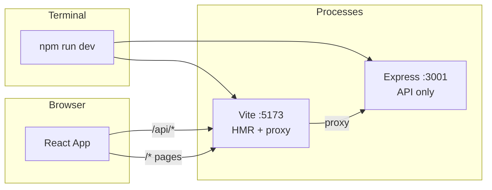

### Production Mode

```mermaid
flowchart LR
    subgraph Build
        B1[npm run build:client<br/>Vite → dist/client]
        B2[npm run build:server<br/>tsc → dist/server]
    end

    subgraph Runtime
        Node[node dist/server/index.js<br/>:3001]
        Static[dist/client/*]
        API[/api/*]
    end

    B1 --> Static
    B2 --> Node
    Node --> Static
    Node --> API
```

| Script | Command | Output |
|--------|---------|--------|
| `dev` | `concurrently dev:server + dev:client` | Two processes |
| `build` | `build:client + build:server` | `dist/` |
| `start` | `node dist/server/index.js` | Single process |
| `test` | `vitest run --no-file-parallelism` | Test results |
| `db:init` | `tsx src/server/db-init.ts` | Fresh database |

---

## Cross-Cutting Concerns

### Validation Architecture

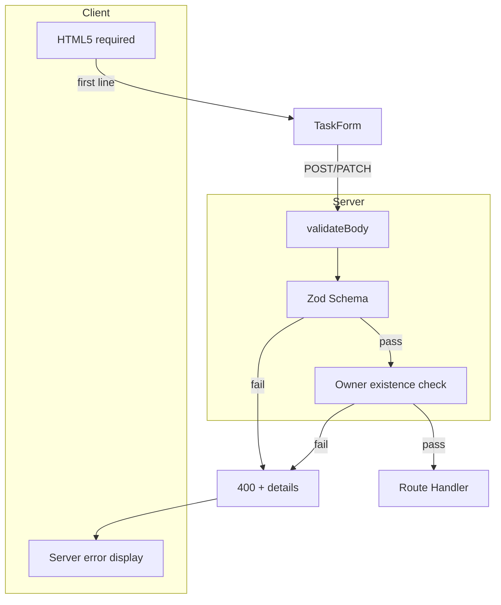

### Activity Audit Trail

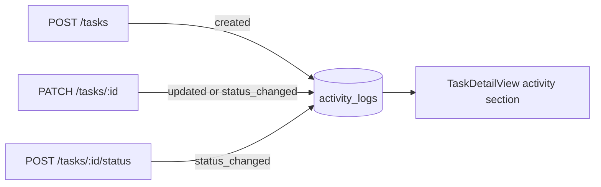

### Accessibility Architecture

| Feature | Implementation |
|---------|----------------|
| Skip link | `Layout.tsx` → `#main-content` |
| Landmarks | `<header>`, `<nav>`, `<main>`, `<footer>` |
| Live regions | `aria-live="polite"` on loading/success |
| Alerts | `role="alert"` on errors |
| Forms | `<label htmlFor>` + `aria-invalid` |
| Navigation | `aria-current="page"` on active link |
| Lists | `role="list"` on task list |

---

## Security Architecture

| Concern | Mitigation | Status |
|---------|------------|--------|
| SQL injection | Parameterized queries (`?` placeholders) | ✅ |
| XSS | React JSX auto-escaping | ✅ |
| Input validation | Zod on write endpoints | ✅ |
| Secrets | None in codebase | ✅ |
| Authentication | Not implemented | ❌ Out of scope |
| CORS | Open in dev (`cors()`) | ⚠️ Tighten for production |
| Rate limiting | Not implemented | ❌ Out of scope |

---

## Scalability Considerations

| Component | Current Limit | Scale Path |
|-----------|--------------|------------|
| SQLite | Single writer, file-based | Migrate to PostgreSQL |
| Dashboard counts | 5 queries per request | Combine into single query |
| Client state | Per-page fetch, no cache | Add React Query |
| Static assets | Served by Express | CDN in front |
| API | Single Node process | Horizontal scale + shared DB |

---

## Related Documents

- [DESIGN_DECISIONS.md](./DESIGN_DECISIONS.md) — Technology choices and rationale
- [DATABASE.md](./DATABASE.md) — Detailed database documentation (Step 7)
- [API.md](./API.md) — Full API reference (Step 6)
- [STATE_MACHINE.md](./STATE_MACHINE.md) — Task status transitions (Step 5)
- [PROJECT_FLOW.md](./PROJECT_FLOW.md) — User and system flows (Step 14)
