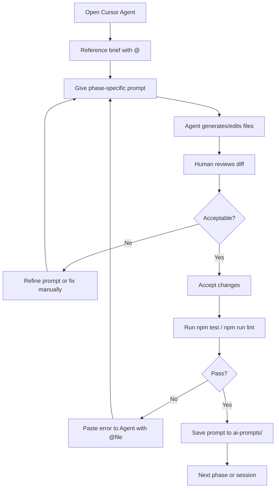

# Cursor Workflow — AI Learning Dashboard / Project Tracker

Cursor IDE-specific practices used to build this assessment project with AI assistance.

---

## Tool Selection

| Tool | Version / Mode | Purpose |
|------|----------------|---------|
| **Cursor IDE** | Latest | Primary development environment |
| **Cursor Agent** | Auto / Composer | Multi-file implementation |
| **Cursor Chat** | Inline | Targeted fixes and questions |
| **Cursor Rules** | Workspace rules | Code style, security, branch safety |

See also: `ai-prompts/tool-specific/cursor-workflow/README.md`

---

## Cursor Features Used

### 1. Agent Mode (Composer)

Used for large, multi-file implementations:

| Session | Agent Task | Files Created/Modified |
|---------|-----------|------------------------|
| Session 1 | Project scaffolding + database + API | ~15 files |
| Session 2 | React frontend (pages, components, CSS) | ~20 files |
| Session 3 | Tests + assessment documentation | ~25 files |
| Session 4 | Review fixes + polish | ~10 files |
| Session 5 | Centralized `docs/` folder | ~15 files |

**How to use:**
1. Open Agent mode (Composer)
2. Paste or reference assessment brief with `@`
3. Provide structured instructions for one phase at a time
4. Review diff before accepting

---

### 2. File Referencing (@)

The `@` symbol was used extensively to provide context without re-explaining:

| Reference | Used When |
|-----------|-----------|
| `@requirements-analysis.md` | Implementing features |
| `@api-contract.md` | Building `api.ts` and route handlers |
| `@data-model.md` | Writing SQL schema and seed data |
| `@src/server/routes/tasks.ts` | Debugging task routes |
| `@src/client/pages/TasksPage.tsx` | Fixing pagination |
| `@acceptance-criteria.md` | Writing tests |
| `@design-notes.md` | Implementing CSS and components |

**Best practice:** Reference the file that is the source of truth for the current task.

---

### 3. Multi-File Editing

Cursor Agent can create and edit multiple files in a single session. Critical for:

- Creating 20+ documentation files in one pass
- Setting up parallel `src/client/`, `src/server/`, `src/shared/` structure
- Applying review fixes across `db.ts`, `dashboard.ts`, `TasksPage.tsx` simultaneously
- Generating `docs/` folder with interconnected requirement documents

---

### 4. Terminal Integration

Agent executed terminal commands with user approval:

```bash
npm install
npm run db:init
npm test
npm run lint
npm run dev
mkdir -p docs ai-prompts/tool-specific/cursor-workflow
```

**Note:** Per workspace rules, all shell commands require manual user approval.

---

### 5. Workspace Rules

Active Cursor rules that guided AI behavior:

| Rule | Effect |
|------|--------|
| Follow existing patterns | Matched naming, folder structure, error handling |
| Minimal changes | Avoided broad refactors unless requested |
| Secure coding defaults | No eval, no hardcoded secrets, parameterized SQL |
| No new dependencies | Kept stack lean (no React Query, no Tailwind) |
| Tests for behavior changes | API tests added with route implementation |
| Branch safety | Work on feature branch, never push to main |

---

## Session Workflow



---

## Phase-by-Phase Cursor Usage

### Planning Phase

**Mode:** Agent  
**Prompt style:** Broad analysis requests  
**Output:** Markdown documentation files  

```
@assessment-brief Analyze Option 2 and generate requirements-analysis.md
```

**Tip:** Ask for structured output format (tables, checklists) to get usable documents.

---

### Design Phase

**Mode:** Agent  
**Prompt style:** Architecture and contract definition  
**Output:** API contract, UI flow, design notes  

```
@requirements-analysis.md Define REST API contract before any code is written.
Include request/response JSON examples.
```

**Tip:** API contract before implementation was the single most valuable design prompt.

---

### Implementation Phase

**Mode:** Agent (large sessions)  
**Prompt style:** Layer-by-layer with explicit file list  
**Output:** Source code  

```
Implement Express API per @api-contract.md:
- Dashboard summary with 5 COUNT queries
- Task CRUD with Zod validation
- Activity logging on mutations
```

**Tip:** Backend-first — schema → routes → frontend. Agent handles cross-file type consistency when `@shared/types.ts` is referenced.

---

### Testing Phase

**Mode:** Agent  
**Prompt style:** Acceptance-driven test list  
**Output:** Test files  

```
@acceptance-criteria.md @api-contract.md
Write Vitest + Supertest tests covering AC-1 through AC-10.
Use isolated test database.
```

**Tip:** Include "dashboard count increases after status change" — catches integration bugs.

---

### Debugging Phase

**Mode:** Chat or Agent (small scope)  
**Prompt style:** Symptom + expected behavior + @file  
**Output:** Targeted fix  

```
@src/server/routes/dashboard.ts
Overdue count is too high. Should exclude completed tasks.
Fix the SQL query.
```

**Tip:** One bug per prompt. Multi-bug prompts often fix one and miss others.

---

### Code Review Phase

**Mode:** Agent  
**Prompt style:** Review checklist  
**Output:** Review notes + fixes  

```
Review full codebase for security, types, accessibility, performance.
Document findings with severity levels in code-review-notes.md.
Then apply fixes and document in review-fixes.md.
```

---

### Documentation Phase

**Mode:** Agent (large batch)  
**Prompt style:** File list with content requirements  
**Output:** 20+ markdown files  

```
Generate all assessment deliverables. Each should reflect the CURRENT implementation.
Reference @src/ for accuracy.
```

---

## Branch Strategy

Per cloud agent rules:

```
main                          ← protected, no direct pushes
└── cursor/assessment-dashboard  ← feature branch for all work
```

**Branch naming convention:** `cursor/<ticket>-<summary>`

---

## Cursor vs Manual Work Split

| Task | Cursor | Manual |
|------|--------|--------|
| Project scaffolding | 90% | 10% (verify structure) |
| SQL schema + seed | 85% | 15% (verify overdue seed task) |
| Express routes | 80% | 20% (business logic review) |
| React components | 85% | 15% (UX decisions) |
| CSS styling | 90% | 10% (visual review) |
| API tests | 85% | 15% (Vitest config fix) |
| Documentation | 90% | 10% (accuracy review) |
| Debugging | 50% | 50% (root cause confirmation) |
| Candidate info | 0% | 100% (personal details) |

---

## What Cursor Did Well

1. **Rapid scaffolding** — Full project structure in one session
2. **Consistent patterns** — Same hook/component patterns across all pages
3. **Type alignment** — Shared types used correctly across client/server
4. **Documentation volume** — 20+ markdown files without placeholder text
5. **Test generation** — Tests matched API contract acceptance criteria
6. **Multi-file refactors** — Review fixes applied across 6 files in one pass

---

## What Required Human Intervention

| Area | Why Human Was Needed |
|------|---------------------|
| Overdue business logic | AI initial query didn't exclude completed |
| Database path after restructure | Folder moved; paths needed manual verification |
| Vitest worker config | Stack overflow required `--no-file-parallelism` |
| Stretch goal decisions | Which optional features to include |
| Personal info | `candidate-info.md` name/email |
| Security review | Confirm React XSS safety, SQL parameterization |
| Step-by-step docs approval | Repository improvement done incrementally |
| Seed data emails | Updated to appropriate addresses |

---

## Tips for Assessment Projects with Cursor

1. **Start with structure** — Ask agent to create folder tree and planning docs first
2. **API contract before UI** — Prevents frontend/backend mismatch
3. **One phase per session** — Planning → Backend → Frontend → Tests → Docs
4. **Review AI output** — Especially business logic (counts, validation, date comparison)
5. **Save prompts as you go** — Copy to `ai-prompts/` after each phase
6. **Use @ for context** — Reference files instead of re-pasting content
7. **Run tests frequently** — `npm test` after each phase; paste failures to agent
8. **Accept incrementally** — Review diffs file by file for large generations
9. **Don't fight the stack** — If AI suggests React Query, decide once and enforce in rules
10. **Document AI usage** — Evaluators look for prompt history and workflow evidence

---

## Cursor Settings & Configuration

### Relevant Workspace Files

| File | Purpose |
|------|---------|
| `package.json` | Scripts for dev, build, test |
| `tsconfig.json` | Client TypeScript config |
| `tsconfig.server.json` | Server TypeScript config |
| `vite.config.ts` | Dev server + API proxy |
| `vitest.config.ts` | Test runner config |
| `.gitignore` | Excludes `node_modules`, `*.db` |

### Environment Variables Used

```bash
PORT=3001                    # Server port
DATABASE_PATH=database/app.db # SQLite location
NODE_ENV=test                # Disables server listen in tests
```

---

## Ethical AI Use

- No secrets or credentials generated or committed
- All AI-generated code reviewed before acceptance
- Prompts preserved in `ai-prompts/` for transparency
- Human authorship acknowledged in `candidate-info.md` and `reflection.md`
- AI limitations documented honestly in `final-ai-usage-summary.md`

---

## Session Log

| Session | Date | Focus | Outcome |
|---------|------|-------|---------|
| 1 | Day 1 AM | Planning + DB + API | Backend complete |
| 2 | Day 1 PM | React frontend | All pages + components |
| 3 | Day 2 | Tests + docs | Assessment deliverables |
| 4 | Day 3 | Review + polish | Fixes applied |
| 5 | Current | Repository improvement | `docs/` folder (Steps 1–3) |

---

## Related Documents

- [ai_workflow.md](./ai_workflow.md) — End-to-end AI development workflow
- [prompt_history.md](./prompt_history.md) — Chronological prompt record
- [design_decisions.md](./design_decisions.md) — Architecture choices
- `ai-prompts/tool-specific/cursor-workflow/README.md` — Original Cursor artifacts
- `final-ai-usage-summary.md` — Executive AI usage summary
