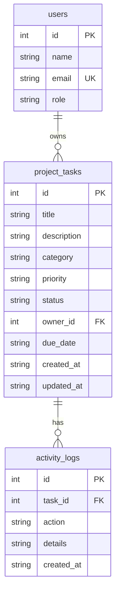

# Data Model

## Entity Relationship Diagram



## Users

Seeded only — no create/update/delete endpoints.

| Column | Type | Constraints |
|--------|------|-------------|
| id | INTEGER | PRIMARY KEY AUTOINCREMENT |
| name | TEXT | NOT NULL |
| email | TEXT | NOT NULL UNIQUE |
| role | TEXT | CHECK (admin, member, viewer) |

## Project Tasks

| Column | Type | Constraints |
|--------|------|-------------|
| id | INTEGER | PRIMARY KEY AUTOINCREMENT |
| title | TEXT | NOT NULL |
| description | TEXT | DEFAULT '' |
| category | TEXT | CHECK (learning, project, research, practice) |
| priority | TEXT | CHECK (low, medium, high) |
| status | TEXT | CHECK (planned, in_progress, completed) |
| owner_id | INTEGER | NOT NULL, FK → users(id) |
| due_date | TEXT | ISO date (YYYY-MM-DD), nullable |
| created_at | TEXT | DEFAULT datetime('now') |
| updated_at | TEXT | DEFAULT datetime('now') |

### Status Lifecycle

```
planned → in_progress → completed
   ↑          ↓              ↓
   └──────────┴──────────────┘
        (any status can revert)
```

### Overdue Definition

A task is overdue when:
- `due_date` is not null
- `due_date < current date`
- `status != 'completed'`

## Activity Logs (Stretch)

| Column | Type | Constraints |
|--------|------|-------------|
| id | INTEGER | PRIMARY KEY AUTOINCREMENT |
| task_id | INTEGER | NOT NULL, FK → project_tasks(id) ON DELETE CASCADE |
| action | TEXT | NOT NULL (created, updated, status_changed) |
| details | TEXT | Nullable description |
| created_at | TEXT | DEFAULT datetime('now') |

## Indexes

- `idx_tasks_status` — filter by status
- `idx_tasks_owner` — filter by owner
- `idx_tasks_priority` — filter by priority
- `idx_tasks_category` — filter by category
- `idx_tasks_due_date` — sort/filter by due date
- `idx_activity_task` — lookup activity by task

## TypeScript Interfaces

See `src/shared/types.ts` for client/server shared type definitions.
