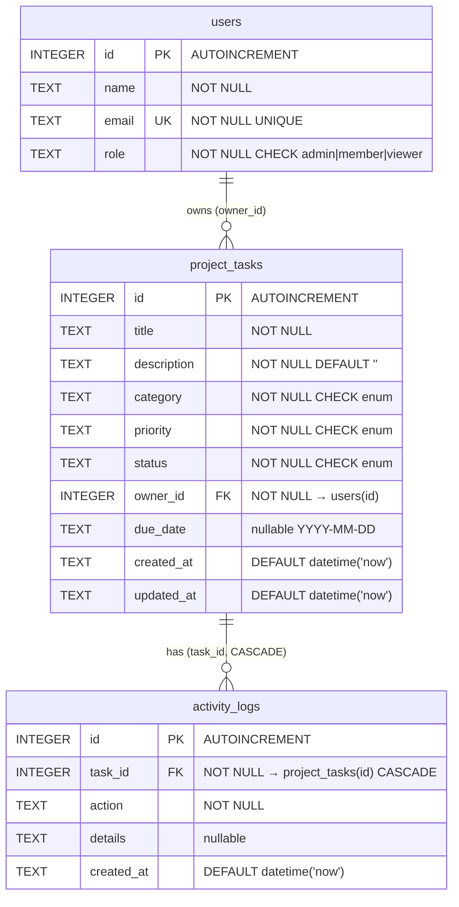
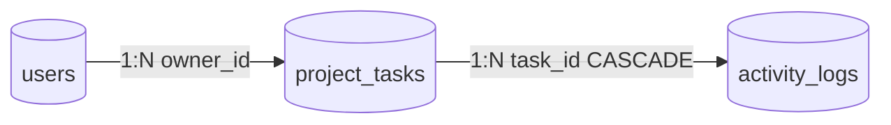
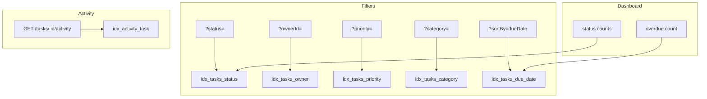
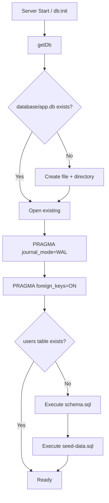

# Database — AI Learning Dashboard / Project Tracker

Database documentation for the **current SQLite implementation**.

> **Note:** This project uses **SQLite** (relational), not MongoDB. Tables are documented below using standard SQL terminology.

---

## Overview

| Property | Value |
|----------|-------|
| **Engine** | SQLite 3 |
| **Driver** | better-sqlite3 (synchronous Node.js binding) |
| **Default file** | `database/app.db` |
| **Configurable via** | `DATABASE_PATH` environment variable |
| **Journal mode** | WAL (Write-Ahead Logging) |
| **Foreign keys** | Enabled (`PRAGMA foreign_keys = ON`) |
| **ORM** | None — raw parameterized SQL |
| **Migration tool** | None — schema applied once on first init |

---

## Entity Relationship Diagram



### Relationship Summary



| Relationship | Type | FK Column | On Delete |
|----------------|------|-----------|-----------|
| users → project_tasks | One-to-many | `project_tasks.owner_id` | Restrict (no action) |
| project_tasks → activity_logs | One-to-many | `activity_logs.task_id` | **CASCADE** |

---

## Tables (Collections)

### 1. `users`

Seeded user accounts for task ownership. **Read-only** via API — no CRUD endpoints.

#### Schema

```sql
CREATE TABLE IF NOT EXISTS users (
  id INTEGER PRIMARY KEY AUTOINCREMENT,
  name TEXT NOT NULL,
  email TEXT NOT NULL UNIQUE,
  role TEXT NOT NULL CHECK (role IN ('admin', 'member', 'viewer'))
);
```

#### Columns

| Column | Type | Constraints | Description |
|--------|------|-------------|-------------|
| `id` | INTEGER | PRIMARY KEY AUTOINCREMENT | Unique user identifier |
| `name` | TEXT | NOT NULL | Display name |
| `email` | TEXT | NOT NULL, UNIQUE | Email address (unique) |
| `role` | TEXT | NOT NULL, CHECK | `admin`, `member`, or `viewer` |

#### Validation

| Rule | Enforcement |
|------|-------------|
| Name required | `NOT NULL` |
| Email required and unique | `NOT NULL UNIQUE` |
| Role must be valid enum | `CHECK (role IN (...))` |

#### Seed Data (4 rows)

| id | name | email | role |
|----|------|-------|------|
| 1 | Sharda Shukla | sharda.shukla@tothenew.com | admin |
| 2 | Jordan Kim | jordan.kim@example.com | member |
| 3 | Sam Patel | sam.patel@example.com | member |
| 4 | Casey Morgan | casey.morgan@example.com | viewer |

---

### 2. `project_tasks`

Core entity — learning goals and project tasks.

#### Schema

```sql
CREATE TABLE IF NOT EXISTS project_tasks (
  id INTEGER PRIMARY KEY AUTOINCREMENT,
  title TEXT NOT NULL,
  description TEXT NOT NULL DEFAULT '',
  category TEXT NOT NULL CHECK (category IN ('learning', 'project', 'research', 'practice')),
  priority TEXT NOT NULL CHECK (priority IN ('low', 'medium', 'high')),
  status TEXT NOT NULL CHECK (status IN ('planned', 'in_progress', 'completed')),
  owner_id INTEGER NOT NULL,
  due_date TEXT,
  created_at TEXT NOT NULL DEFAULT (datetime('now')),
  updated_at TEXT NOT NULL DEFAULT (datetime('now')),
  FOREIGN KEY (owner_id) REFERENCES users(id)
);
```

#### Columns

| Column | Type | Constraints | API Field | Description |
|--------|------|-------------|-----------|-------------|
| `id` | INTEGER | PK AUTOINCREMENT | `id` | Task identifier |
| `title` | TEXT | NOT NULL | `title` | Task title (1–200 chars via Zod) |
| `description` | TEXT | NOT NULL, DEFAULT `''` | `description` | Task description |
| `category` | TEXT | NOT NULL, CHECK | `category` | `learning`, `project`, `research`, `practice` |
| `priority` | TEXT | NOT NULL, CHECK | `priority` | `low`, `medium`, `high` |
| `status` | TEXT | NOT NULL, CHECK | `status` | `planned`, `in_progress`, `completed` |
| `owner_id` | INTEGER | NOT NULL, FK → users | `ownerId` | Task owner |
| `due_date` | TEXT | nullable | `dueDate` | ISO date `YYYY-MM-DD` or NULL |
| `created_at` | TEXT | NOT NULL, DEFAULT now | `createdAt` | Creation timestamp |
| `updated_at` | TEXT | NOT NULL, DEFAULT now | `updatedAt` | Last update timestamp |

#### Enum Values

| Column | Allowed Values |
|--------|----------------|
| `category` | `learning`, `project`, `research`, `practice` |
| `priority` | `low`, `medium`, `high` |
| `status` | `planned`, `in_progress`, `completed` |

#### Validation Layers

| Layer | Rules |
|-------|-------|
| **Database CHECK** | Enum values for category, priority, status |
| **Database NOT NULL** | title, category, priority, status, owner_id |
| **Database FK** | owner_id must reference existing user |
| **Zod (API)** | title 1–200, description max 2000, ownerId positive int |
| **Route handler** | Owner existence verified before insert/update |

#### Seed Data Summary (8 rows)

| id | title | status | priority | owner_id | due_date | Notes |
|----|-------|--------|----------|----------|----------|-------|
| 1 | Complete React Hooks deep-dive | in_progress | high | 1 | 2026-07-15 | — |
| 2 | Build dashboard summary cards | completed | high | 2 | 2026-07-05 | — |
| 3 | TypeScript generics practice | planned | medium | 3 | 2026-07-20 | — |
| 4 | API contract documentation | in_progress | medium | 2 | 2026-07-10 | — |
| 5 | Accessibility audit | planned | low | 4 | 2026-07-25 | — |
| 6 | Overdue: SQLite migration notes | planned | high | 1 | 2026-06-30 | **Overdue demo task** |
| 7 | Vitest unit tests for API | in_progress | medium | 3 | 2026-07-12 | — |
| 8 | CSS responsive polish | completed | low | 2 | 2026-07-03 | — |

**Status distribution:** 2 completed, 3 in_progress, 3 planned  
**Overdue (if today > 2026-06-30):** Task #6 (planned, past due date)

---

### 3. `activity_logs`

Audit trail for task changes (stretch feature).

#### Schema

```sql
CREATE TABLE IF NOT EXISTS activity_logs (
  id INTEGER PRIMARY KEY AUTOINCREMENT,
  task_id INTEGER NOT NULL,
  action TEXT NOT NULL,
  details TEXT,
  created_at TEXT NOT NULL DEFAULT (datetime('now')),
  FOREIGN KEY (task_id) REFERENCES project_tasks(id) ON DELETE CASCADE
);
```

#### Columns

| Column | Type | Constraints | API Field | Description |
|--------|------|-------------|-----------|-------------|
| `id` | INTEGER | PK AUTOINCREMENT | `id` | Log entry identifier |
| `task_id` | INTEGER | NOT NULL, FK CASCADE | `taskId` | Parent task |
| `action` | TEXT | NOT NULL | `action` | Event type |
| `details` | TEXT | nullable | `details` | Human-readable description |
| `created_at` | TEXT | NOT NULL, DEFAULT now | `createdAt` | Event timestamp |

#### Action Types

| Action | Trigger | Example Details |
|--------|---------|-----------------|
| `created` | `POST /api/tasks` | `Task "Title" created` |
| `updated` | `PATCH /api/tasks/:id` (non-status) | `Task fields updated` |
| `status_changed` | Status change via PATCH or POST /status | `Status changed from planned to in_progress` |

#### Cascade Behavior

When a `project_tasks` row is deleted, all associated `activity_logs` rows are **automatically deleted** (`ON DELETE CASCADE`).

> **Note:** No DELETE endpoint exists in the API — cascade is a schema safeguard only.

#### Seed Data (5 rows)

| id | task_id | action | details |
|----|---------|--------|---------|
| 1 | 1 | created | Task created with status planned |
| 2 | 1 | status_changed | Status changed from planned to in_progress |
| 3 | 2 | created | Task created with status planned |
| 4 | 2 | status_changed | Status changed from in_progress to completed |
| 5 | 6 | created | Task created — now overdue |

---

## Indexes

| Index Name | Table | Column(s) | Purpose |
|------------|-------|-----------|---------|
| `idx_tasks_status` | `project_tasks` | `status` | Filter by status (`?status=`) |
| `idx_tasks_owner` | `project_tasks` | `owner_id` | Filter by owner (`?ownerId=`) |
| `idx_tasks_priority` | `project_tasks` | `priority` | Filter by priority |
| `idx_tasks_category` | `project_tasks` | `category` | Filter by category |
| `idx_tasks_due_date` | `project_tasks` | `due_date` | Sort/filter by due date, overdue queries |
| `idx_activity_task` | `activity_logs` | `task_id` | Lookup activity by task |

### Index Usage by Query



### Implicit Indexes

SQLite automatically creates indexes for:
- `users.id` (PRIMARY KEY)
- `project_tasks.id` (PRIMARY KEY)
- `activity_logs.id` (PRIMARY KEY)
- `users.email` (UNIQUE constraint)

---

## Relationships

### users → project_tasks

```
users (1) ──────< (N) project_tasks
         owner_id
```

- Every task **must** have an owner (`owner_id NOT NULL`)
- One user can own **many** tasks
- Deleting a user with existing tasks would **fail** (FK restrict — no ON DELETE action)
- API validates owner exists before insert/update

**Common JOIN:**
```sql
SELECT t.*, u.name as owner_name, u.email as owner_email, u.role as owner_role
FROM project_tasks t
JOIN users u ON t.owner_id = u.id
WHERE t.id = ?
```

### project_tasks → activity_logs

```
project_tasks (1) ──────< (N) activity_logs
              task_id ON DELETE CASCADE
```

- Every activity log **must** reference a task
- One task can have **many** activity entries
- Deleting a task **cascades** to delete its activity logs

**Common query:**
```sql
SELECT id, task_id, action, details, created_at
FROM activity_logs
WHERE task_id = ?
ORDER BY created_at DESC
```

---

## Validation Summary

### Database-Level Constraints

| Table | Constraint Type | Columns |
|-------|----------------|---------|
| users | NOT NULL | name, email, role |
| users | UNIQUE | email |
| users | CHECK | role ∈ {admin, member, viewer} |
| project_tasks | NOT NULL | title, description, category, priority, status, owner_id, created_at, updated_at |
| project_tasks | CHECK | category, priority, status enums |
| project_tasks | FOREIGN KEY | owner_id → users(id) |
| activity_logs | NOT NULL | task_id, action, created_at |
| activity_logs | FOREIGN KEY CASCADE | task_id → project_tasks(id) |

### Application-Level Validation (Zod)

Validation occurs **before** database insert/update. See [API.md](./API.md) for full rules.

| Operation | Validator | Key Rules |
|-----------|-----------|-----------|
| Create task | `createTaskSchema` | title required 1–200, enums, ownerId positive |
| Update task | `updateTaskSchema` | all fields optional, same constraints when present |
| Owner check | Route handler | `SELECT id FROM users WHERE id = ?` |

### Business Rules (Computed, Not Stored)

| Rule | Logic | Used In |
|------|-------|---------|
| **Overdue** | `due_date IS NOT NULL AND due_date < today AND status != 'completed'` | Dashboard count, UI badge |
| **High priority count** | `priority = 'high'` (all statuses) | Dashboard count |

---

## Data Access Patterns

### Connection Management

```typescript
// Singleton connection in src/server/db.ts
const db = getDb();  // Opens database/app.db, enables WAL + FK

// Test isolation
process.env.DATABASE_PATH = 'database/test.db';
resetDbForTests();  // Delete file, re-init schema + seed
```

### Query Patterns

| Pattern | Example | Used For |
|---------|---------|----------|
| **Get by ID** | `.get(id)` | Task detail, owner check |
| **List with JOIN** | `.all(...params, limit, offset)` | Task list with owner |
| **Count** | `.get()` → `{ count }` | Dashboard metrics, pagination total |
| **Insert** | `.run(...values)` → `lastInsertRowid` | Create task, log activity |
| **Update** | `.run(...values, id)` | PATCH task, status change |

All queries use **parameterized placeholders** (`?`) to prevent SQL injection.

### Key SQL Queries

**Dashboard — total:**
```sql
SELECT COUNT(*) as count FROM project_tasks
```

**Dashboard — overdue:**
```sql
SELECT COUNT(*) as count FROM project_tasks
WHERE status != 'completed'
  AND due_date IS NOT NULL
  AND due_date < ?
```

**Task list — filtered + paginated:**
```sql
SELECT t.*, u.name as owner_name, u.email as owner_email, u.role as owner_role
FROM project_tasks t
JOIN users u ON t.owner_id = u.id
WHERE t.status = ? AND (t.title LIKE ? OR t.description LIKE ?)
ORDER BY t.created_at DESC
LIMIT ? OFFSET ?
```

**Activity insert:**
```sql
INSERT INTO activity_logs (task_id, action, details) VALUES (?, ?, ?)
```

---

## Initialization & Lifecycle



### Commands

```bash
# Initialize database manually
npm run db:init

# Reset to seed state
rm database/app.db && npm run db:init

# Inspect data
sqlite3 database/app.db "SELECT * FROM project_tasks;"

# Test database (auto-created/destroyed by tests)
DATABASE_PATH=database/test.db npm test
```

### File Locations

```
database/
├── schema-or-migrations/
│   └── schema.sql          # Table definitions + indexes
├── seed-data/
│   └── seed-data.sql       # Sample users, tasks, activity
├── app.db                  # Runtime database (gitignored)
└── test.db                 # Test database (gitignored, created by tests)
```

---

## TypeScript Mapping

Database columns map to shared TypeScript interfaces in `src/shared/types.ts`:

| Table | Column (snake_case) | Interface Field (camelCase) |
|-------|----------------------|----------------------------|
| users | id, name, email, role | `User` |
| project_tasks | id, title, description, category, priority, status, owner_id, due_date, created_at, updated_at | `ProjectTask` |
| activity_logs | id, task_id, action, details, created_at | `ActivityLog` |

**Row mapping** in `src/server/routes/tasks.ts`:
```typescript
function mapTaskRow(row: TaskRow): ProjectTask {
  return {
    id: row.id,
    title: row.title,
    // ... snake_case → camelCase
    ownerId: row.owner_id,
    dueDate: row.due_date,
    createdAt: row.created_at,
    updatedAt: row.updated_at,
    owner: { id, name, email, role }  // from JOIN
  };
}
```

---

## Data Volume & Capacity

| Metric | Current (Seed) | Expected Capacity |
|--------|----------------|-------------------|
| Users | 4 | Fixed (seeded only) |
| Tasks | 8 | Hundreds (indexed) |
| Activity logs | 5+ (grows on mutations) | Thousands per task |
| File size | < 100 KB | Suitable up to ~10K tasks |

SQLite handles this workload efficiently with WAL mode and indexed columns.

---

## Backup & Recovery

### Development

```bash
# Backup
cp database/app.db database/app.db.backup

# Restore
cp database/app.db.backup database/app.db
```

### Production Recommendations

- Schedule regular `app.db` file backups
- WAL mode allows hot backups while server runs
- Consider migration tooling (e.g., `better-sqlite3` + versioned SQL files) if schema evolves

---

## Test Database Isolation

| Setting | Value |
|---------|-------|
| Test DB path | `database/test.db` |
| Set via | `process.env.DATABASE_PATH` before app import |
| Reset | `resetDbForTests()` in `beforeAll` |
| Cleanup | `fs.unlinkSync` in `afterAll` |

Each test suite starts with a fresh copy of seed data.

---

## Schema Change Policy

| Policy | Detail |
|--------|--------|
| **Assessment constraint** | Schema must not change per project rules |
| **Current approach** | `CREATE TABLE IF NOT EXISTS` — idempotent |
| **No migrations** | Schema applied only when `users` table missing |
| **Future path** | Versioned migration files in `schema-or-migrations/` |

---

## Security Considerations

| Concern | Mitigation |
|---------|------------|
| SQL injection | Parameterized queries only (`?` placeholders) |
| Data exposure | No auth — all data readable via API |
| File access | `app.db` should not be web-accessible |
| Secrets | No credentials stored in database |

---

## Related Documents

- [ARCHITECTURE.md](./ARCHITECTURE.md) — Database layer in system architecture
- [API.md](./API.md) — API endpoints that read/write these tables
- [STATE_MACHINE.md](./STATE_MACHINE.md) — Task status transitions
- [DESIGN_DECISIONS.md](./DESIGN_DECISIONS.md) — DD-4 SQLite choice rationale
- `database/setup-notes.md` — Quick setup reference
- `database/schema-or-migrations/schema.sql` — Source schema
- `database/seed-data/seed-data.sql` — Source seed data
