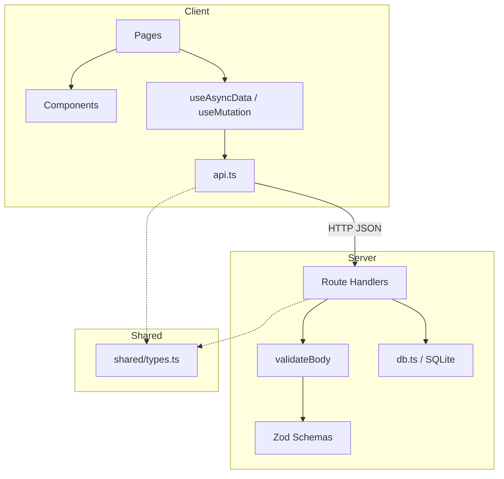
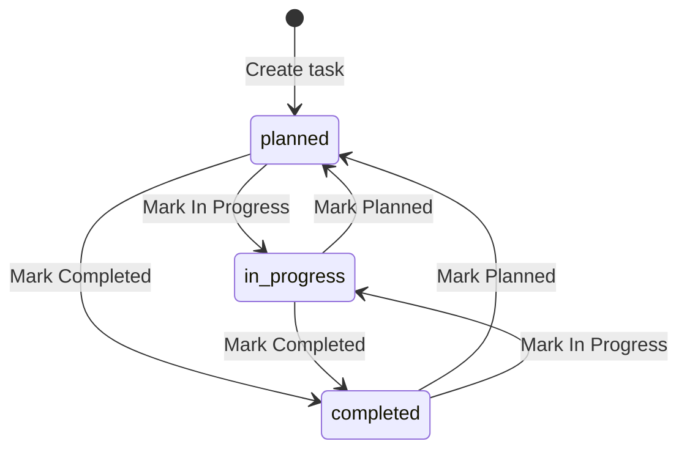

# Design Decisions — AI Learning Dashboard / Project Tracker

Architecture and technology decisions made during development, including rationale, alternatives considered, and trade-offs.

---

## Decision Summary

| # | Decision | Choice | Status |
|---|----------|--------|--------|
| DD-1 | Frontend framework | React 18 + TypeScript | ✅ Implemented |
| DD-2 | Build tool | Vite | ✅ Implemented |
| DD-3 | Backend runtime | Node.js + Express 4 | ✅ Implemented |
| DD-4 | Database | SQLite (better-sqlite3) | ✅ Implemented |
| DD-5 | Validation | Zod | ✅ Implemented |
| DD-6 | Architecture pattern | Layered MVC (routes + shared types) | ✅ Implemented |
| DD-7 | API style | REST JSON | ✅ Implemented |
| DD-8 | State management | Custom hooks (no Redux) | ✅ Implemented |
| DD-9 | Task status model | Flexible state machine | ✅ Implemented |
| DD-10 | Authentication | None (deferred) | ❌ Out of scope |
| DD-11 | Testing | Vitest + Supertest + Testing Library | ✅ Implemented |

---

## DD-1: React 18 with TypeScript

### Decision

Use **React 18** with **TypeScript** for the frontend.

### Rationale

- Assessment is **frontend-heavy** — React is the industry standard for component-based UIs
- TypeScript provides compile-time safety for props, API responses, and shared types
- React 18 features (StrictMode, concurrent-ready) with no class components needed
- Large ecosystem for testing (`@testing-library/react`) and routing (`react-router-dom`)

### Alternatives Considered

| Alternative | Why Not Chosen |
|-------------|----------------|
| Vue 3 | Less common in assessment context; team familiarity with React |
| Svelte | Smaller ecosystem for enterprise patterns |
| Plain JavaScript | No type safety across client/server boundary |

### Trade-offs

- Requires build step (Vite) — acceptable for modern frontend
- No server-side rendering — not needed for dashboard app

---

## DD-2: Vite as Build Tool

### Decision

Use **Vite 6** for development server and production bundling.

### Rationale

- Fast HMR during development
- Built-in proxy to Express API (`/api` → `localhost:3001`)
- Simple configuration for React + TypeScript
- Production build outputs to `dist/client` served by Express

### Configuration

```typescript
// vite.config.ts
server: {
  port: 5173,
  proxy: { '/api': { target: 'http://localhost:3001', changeOrigin: true } }
}
```

### Trade-offs

- Two processes in dev (`concurrently`) — mitigated by `npm run dev` script
- Client root at `src/client/` — non-standard but keeps frontend isolated

---

## DD-3: Node.js + Express 4

### Decision

Use **Express 4** on **Node.js** with ES modules for the API layer.

### Rationale

- Minimal, well-understood framework for REST APIs
- Middleware pattern fits validation (`validateBody`) and CORS
- `export default app` enables Supertest integration testing
- No heavy framework overhead for a small CRUD API

### Alternatives Considered

| Alternative | Why Not Chosen |
|-------------|----------------|
| Fastify | Less familiar; Express sufficient for scope |
| NestJS | Over-engineered for assessment CRUD |
| Serverless (Lambda) | Adds deployment complexity |

### Architecture

```
index.ts          → App setup, middleware, static serving
routes/           → Resource handlers (dashboard, tasks, users)
middleware/       → validateBody (Zod)
validators.ts     → Zod schemas
db.ts             → SQLite connection
```

### Trade-offs

- No formal service layer — business logic in route handlers (acceptable for small API)
- No dependency injection — direct `getDb()` calls

---

## DD-4: SQLite with better-sqlite3

### Decision

Use **SQLite** via **better-sqlite3** for persistence.

### Rationale

- **Zero configuration** — no Docker, no external database server
- **File persistence** — data survives server restart (assessment requirement)
- **Synchronous API** — simpler code without async/await for DB calls
- **WAL mode** — better concurrent read performance
- **Foreign keys** — referential integrity enforced

### Alternatives Considered

| Alternative | Why Not Chosen |
|-------------|----------------|
| MongoDB | Assessment template reference; SQLite simpler for relational data |
| PostgreSQL | Requires external service; overkill for assessment |
| In-memory store | Fails persistence requirement |
| JSON file | No query capabilities, no constraints |

### Schema Design

- 3 tables: `users`, `project_tasks`, `activity_logs`
- CHECK constraints on enums (status, priority, category, role)
- Indexes on frequently filtered/sorted columns
- CASCADE delete on activity logs when task deleted

### Trade-offs

- Single writer — not suitable for high-concurrency production
- No migration framework — schema applied once on first run
- Date stored as TEXT (`YYYY-MM-DD`) — simple but no timezone handling

---

## DD-5: Zod for Validation

### Decision

Use **Zod** for server-side request validation.

### Rationale

- TypeScript-first schema definition with inferred types
- `safeParse` returns structured errors mapped to API response format
- Reusable `validateBody` middleware wraps any Zod schema
- Consistent `{ error, details }` error format for frontend consumption

### Implementation

```typescript
// Middleware pattern
export function validateBody<T>(schema: ZodSchema<T>) {
  return (req, res, next) => {
    const result = schema.safeParse(req.body);
    if (!result.success) {
      res.status(400).json({ error: 'Validation failed', details: formatZodErrors(result.error) });
      return;
    }
    req.body = result.data;
    next();
  };
}
```

### Trade-offs

- Validation only on write endpoints (POST/PATCH) — query params validated manually
- Owner existence checked separately in route handler (not in Zod schema)

---

## DD-6: Layered MVC Architecture

### Decision

Use a **lightweight MVC pattern** without a formal service layer.

### Rationale

- **Model:** SQLite tables + `src/shared/types.ts`
- **View:** React pages and components
- **Controller:** Express route handlers

### Layer Diagram



### Why No Service Layer

- 8 API endpoints with straightforward CRUD logic
- Adding a service layer would increase files without reducing complexity
- Route handlers are ~300 lines total — manageable without abstraction

### Trade-offs

- Business logic (overdue, activity logging) mixed with HTTP handling
- Would extract services if API grows beyond 15+ endpoints

---

## DD-7: REST JSON APIs

### Decision

Use **REST** with **JSON** request/response bodies.

### Rationale

- Standard pattern for frontend/backend communication
- `fetch` API works natively in browser
- Clear HTTP semantics: GET (read), POST (create), PATCH (update)
- Separate `POST /tasks/:id/status` for quick status changes (intent-revealing)

### API Design Principles

1. **Consistent error format:** `{ error: string, details?: Record<string, string[]> }`
2. **Pagination envelope:** `{ items, total, page, limit, totalPages }`
3. **Owner join on task responses:** Avoid N+1 queries from frontend
4. **Query params for filtering:** Stateless, cacheable, bookmarkable

### Trade-offs

- No GraphQL — overkill for simple CRUD
- No HATEOAS links — frontend knows routes
- No API versioning — single version for assessment

---

## DD-8: Custom Hooks Over Global State

### Decision

Use **custom hooks** (`useAsyncData`, `useMutation`) instead of Redux, Zustand, or React Query.

### Rationale

- Each page fetches its own data — no shared global state needed
- Hooks encapsulate loading/error/validation patterns consistently
- Zero additional dependencies
- `reload()` after mutations is sufficient for assessment scope

### Hook Design

```typescript
useAsyncData(fetcher, deps)  → { data, loading, error, validationErrors, reload }
useMutation(mutator)         → { execute, loading, error, validationErrors, success, reset }
```

### Alternatives Considered

| Alternative | Why Not Chosen |
|-------------|----------------|
| React Query | Adds dependency; manual reload works for scope |
| Redux Toolkit | No global state requirements |
| Context API | Overkill for server-fetched data |

### Trade-offs

- No automatic cache invalidation across pages
- Navigating to dashboard after mutation requires remount to refresh counts
- `eslint-disable` on `useAsyncData` deps — acceptable for assessment

---

## DD-9: Task Status State Machine

### Decision

Implement task status as a **flexible state machine** allowing any transition between three states.

### States

```
planned | in_progress | completed
```

### Transitions



### Rationale

- Assessment requires "mark in-progress or completed" — quick actions on detail page
- Allowing reverse transitions (completed → planned) supports real-world corrections
- No transition guards — any status can change to any other
- Status validated server-side against enum values

### Business Rules

- Overdue calculation excludes `completed` tasks regardless of due date
- Status change via `POST /tasks/:id/status` logs `status_changed` activity
- Status change via `PATCH /tasks/:id` also logs activity if status field changes

### Alternatives Considered

| Alternative | Why Not Chosen |
|-------------|----------------|
| Strict linear flow (planned → in_progress → completed only) | Too restrictive for corrections |
| Kanban drag-and-drop | Higher UI complexity; buttons sufficient |
| Separate workflow engine | Over-engineered for 3 states |

### Trade-offs

- No audit of invalid transition attempts (all transitions allowed)
- No role-based status permissions (no auth)

---

## DD-10: No Authentication (Deferred)

### Decision

**Do not implement** authentication, JWT, or RBAC enforcement.

### Rationale

- Assessment scope focuses on frontend quality and CRUD, not auth
- Users are seeded for ownership display only
- Adding JWT would require login UI, token storage, middleware — significant scope increase
- Roles (`admin`, `member`, `viewer`) stored in DB for future use but not enforced

### Impact

- All API endpoints are public
- Suitable for local/trusted environment only
- Documented as out-of-scope in requirements

### Future Path

If authentication were added:
1. JWT middleware on Express routes
2. Login page with session/token storage
3. Role-based route guards on frontend
4. Owner-scoped task visibility

---

## DD-11: Vitest for Testing

### Decision

Use **Vitest** with **Supertest** (API) and **Testing Library** (components).

### Rationale

- Same config as Vite — no Jest setup needed
- Supertest integrates with exported Express app
- Testing Library encourages accessible component tests
- `DATABASE_PATH` env enables test database isolation

### Configuration Decisions

| Setting | Value | Reason |
|---------|-------|--------|
| `--no-file-parallelism` | Enabled | Prevents Vitest worker stack overflow with SQLite |
| `pool: 'forks'` | Single fork | Isolates test database access |
| `environmentMatchGlobs` | jsdom for client tests | DOM needed for component tests |
| `resetDbForTests()` | beforeAll | Fresh seed data per suite |

### Trade-offs

- No E2E browser tests (Playwright deferred)
- Limited component coverage (forms/pages untested)
- API tests share single fork — slower but stable

---

## Cross-Cutting Decisions

### Shared Types (`src/shared/types.ts`)

- Single source of truth for interfaces used by client and server
- Client re-exports via `src/client/types/index.ts` with UI helpers (`formatDate`, `isOverdue`, label maps)
- Prevents type drift between API responses and frontend consumption

### Error Handling Strategy

| Layer | Pattern |
|-------|---------|
| Server | HTTP status + JSON `{ error, details }` |
| Client `api.ts` | `ApiRequestError` class with status and details |
| UI | `ErrorState`, `error-inline`, field-level errors |

### UI State Components

Built early as reusable primitives:
- `LoadingState` — spinner with `role="status"`
- `EmptyState` — contextual empty messages with CTA
- `ErrorState` — alert with retry button
- `SuccessBanner` — dismissible success feedback

**Decision rationale:** Investing in state components upfront ensured consistency across all 5 pages.

### CSS Approach

- Single `global.css` with design tokens (CSS custom properties)
- No CSS-in-JS or Tailwind — keeps dependencies minimal
- BEM-like class naming (`.task-list`, `.summary-card`, `.badge-status`)

---

## Deferred Decisions

| Decision | Reason Deferred |
|----------|-----------------|
| Authentication (JWT) | Out of assessment scope |
| Dark mode | Time constraint; light theme sufficient |
| React Query / SWR | Custom hooks adequate |
| Combined dashboard COUNT query | Premature optimization |
| E2E tests (Playwright) | Time constraint |
| Request logging (morgan) | Not required for assessment |
| Database migrations | Schema stable; auto-init sufficient |

---

## Related Documents

- [architecture.md](./architecture.md) — System architecture (Step 4)
- [state_machine.md](./state_machine.md) — Task status state machine (Step 5)
- [ai_workflow.md](./ai_workflow.md) — How AI informed these decisions
