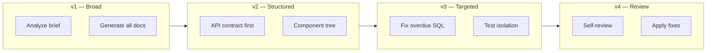

# Prompt History — AI Learning Dashboard / Project Tracker

Chronological record of key AI prompts used during development, organized by phase. Full prompt archives are in `ai-prompts/`.

---

## Prompt Evolution Overview



**Pattern:** Prompts evolved from broad scaffolding requests to targeted, file-referenced debugging and review prompts.

---

## Phase 1: Planning

### Prompt 1.1 — Project Analysis (Initial)

```
Analyze Project Option 2 (Frontend-Heavy — AI Learning Dashboard / Project Tracker) 
from the assessment brief. Break down:
- Core entities and their fields
- Mandatory features vs stretch goals
- Required repository structure
- Suggested tech stack for a frontend-heavy project with persistence
```

**Outcome:** `requirements-analysis.md` with entity definitions and feature matrix.

**Evolution:** Expanded in follow-up to include acceptance criteria and implementation plan.

---

### Prompt 1.2 — Requirements Document

```
Generate requirements-analysis.md covering:
- Business context
- Entity definitions (User, ProjectTask)
- Feature list with implementation mapping
- Dashboard summary card requirements
- Non-functional requirements and out-of-scope items
```

**Outcome:** Structured requirements with mandatory vs stretch classification.

---

### Prompt 1.3 — Acceptance Criteria

```
Create acceptance criteria as a checklist for all core features (AC-1 through AC-10) 
and stretch goals (AC-11 through AC-14). Each criterion should be testable.
```

**Outcome:** `acceptance-criteria.md` with 69 verifiable criteria.

---

### Prompt 1.4 — Implementation Plan

```
Create a phased implementation plan:
Phase 1: Foundation (scaffolding, database)
Phase 2: Backend API
Phase 3: Frontend core components
Phase 4: Frontend pages
Phase 5: Polish and testing
Include risk mitigation table.
```

**Outcome:** `implementation-plan.md` with 5 phases and risk table.

---

### Prompt 1.5 — Data Model

```
Design the data model with:
- ER diagram in mermaid
- Table definitions with constraints
- Status lifecycle
- Overdue definition
- Indexes for common queries
```

**Outcome:** `data-model.md` with SQLite schema design.

---

## Phase 2: Design

### Prompt 2.1 — UI Architecture

```
Design the React component architecture for the AI Learning Dashboard:
- App shell with navigation
- Dashboard page with summary cards
- Task list with filters
- Task detail with quick actions
- Create/edit forms
Show component tree hierarchy.
```

**Outcome:** Component tree in `design-notes.md`.

---

### Prompt 2.2 — Visual Design System

```
Define a design system with:
- Color tokens for status (planned, in_progress, completed) and priority (low, medium, high)
- Typography scale using Inter font
- Card-based layout for dashboard metrics
- Responsive breakpoints for mobile
Document in design-notes.md
```

**Outcome:** Color system, typography, and breakpoint definitions.

---

### Prompt 2.3 — UI Flow

```
Map all user flows:
1. View dashboard
2. Create task
3. Browse and filter tasks
4. View task detail
5. Quick status change
6. Edit task
Include UI state matrix (loading, empty, error, success) for each page.
```

**Outcome:** `ui-flow.md` with navigation map and state matrix.

---

### Prompt 2.4 — API Contract (Critical)

```
Define REST API contract before implementation:
- GET /dashboard/summary
- CRUD /tasks with query params for filter/search/sort/pagination
- POST /tasks/:id/status
- GET /tasks/:id/activity
- GET /users
Include request/response JSON examples and error format.
```

**Outcome:** `api-contract.md` — became the single source of truth for backend and frontend.

**Why it mattered:** Prevented frontend/backend drift throughout implementation.

---

## Phase 3: Implementation

### Prompt 3.1 — Project Scaffolding

```
Create full project structure for ai-practical-assessment:
- package.json with React 18, Vite, Express, better-sqlite3, Zod, Vitest
- TypeScript configs for client and server
- Folder structure: src/client, src/server, src/shared, tests, database
- Vite proxy to Express API on port 3001
```

**Outcome:** Complete project skeleton with working `npm run dev`.

---

### Prompt 3.2 — Database Layer

```
Implement SQLite database layer:
- schema.sql with users, project_tasks, activity_logs tables
- seed-data.sql with 4 users and 8 tasks including one overdue task
- db.ts with auto-initialization, WAL mode, foreign keys
- db-init.ts script
```

**Outcome:** `database/` folder with schema, seed, and connection module.

**Human fix:** Path updated after moving schema to `schema-or-migrations/` subdirectory.

---

### Prompt 3.3 — Express API Routes

```
Implement Express API:
- Dashboard summary with 5 COUNT queries (total, completed, in_progress, overdue excluding completed, high priority)
- Task CRUD with Zod validation
- Filtering, search, sorting, pagination on GET /tasks
- Activity logging on create/update/status change
- Users endpoint for owner dropdown
```

**Outcome:** `src/server/routes/` with dashboard, tasks, and users routers.

---

### Prompt 3.4 — React Frontend

```
Build React frontend with:
- useAsyncData and useMutation hooks for API state management
- SummaryCards, TaskList, TaskForm, TaskDetailView components
- LoadingState, EmptyState, ErrorState, SuccessBanner components
- Pages: Dashboard, Tasks, TaskDetail, CreateTask, EditTask
- TaskFiltersBar with debounced search and multiple filters
- Responsive CSS with accessibility (skip link, ARIA, focus styles)
```

**Outcome:** Complete React SPA with all pages and reusable components.

---

### Prompt 3.5 — Shared Types

```
Create src/shared/types.ts with TypeScript interfaces used by both client and server:
User, ProjectTask, DashboardSummary, ActivityLog, TaskFilters, PaginatedTasks, CreateTaskInput, UpdateTaskInput
```

**Outcome:** Single type source shared across client and server.

---

## Phase 4: Testing

### Prompt 4.1 — API Tests

```
Write Vitest + Supertest integration tests in tests/api/tasks.test.ts:
- Dashboard summary returns all five count fields
- Task list with pagination
- Status filter and keyword search
- Create task with validation (reject missing title)
- Get task detail and 404 for missing
- PATCH update fields
- POST status change
- Activity log endpoint
- Users endpoint
- Dashboard completed count increases after marking task completed
Use isolated test database (database/test.db).
```

**Outcome:** 12 API integration tests.

---

### Prompt 4.2 — Component Tests

```
Write React component tests in tests/client/components.test.tsx:
- SummaryCards renders all five cards with correct values
- LoadingState shows spinner and message with role="status"
- EmptyState shows title and description
- ErrorState shows error message and calls onRetry when clicked
Use @testing-library/react and vitest.
```

**Outcome:** 4 component tests.

---

### Prompt 4.3 — Test Strategy

```
Write test-strategy.md covering:
- Test levels (API integration, component, manual)
- What's tested and what's deferred
- How to run tests
- CI recommendation
- Test data isolation approach
```

**Outcome:** `test-strategy.md`.

---

## Phase 5: Debugging

### Prompt 5.1 — ESM Path Resolution

```
Fix database path resolution in Node.js ESM modules.
__dirname is not available — use fileURLToPath(import.meta.url) 
to resolve paths to database/schema.sql relative to project root.
```

**Files changed:** `src/server/db.ts`, `src/server/index.ts`

---

### Prompt 5.2 — Overdue Count Bug

```
Dashboard overdue count is too high. Overdue should only count tasks where:
- due_date is not null
- due_date < today
- status is NOT 'completed'
Fix the SQL query in dashboard route.
```

**Files changed:** `src/server/routes/dashboard.ts`

---

### Prompt 5.3 — Vite API Proxy

```
Frontend fetch to /api returns 404 in development.
Configure Vite dev server proxy to forward /api requests to Express on localhost:3001.
```

**Files changed:** `vite.config.ts`

---

### Prompt 5.4 — Test Database Isolation

```
API tests fail intermittently due to shared database state.
Set process.env.DATABASE_PATH to database/test.db before importing app.
Use resetDbForTests() in beforeAll and delete test.db in afterAll.
```

**Files changed:** `tests/api/tasks.test.ts`, `src/server/db.ts`

---

### Prompt 5.5 — Pagination Reset

```
When user changes search or filter on tasks page, pagination should reset to page 1.
Add useEffect to reset page when filter dependencies change.
```

**Files changed:** `src/client/pages/TasksPage.tsx`

---

## Phase 6: Code Review

### Prompt 6.1 — Self Review

```
Review the full codebase for:
- Security issues (SQL injection, XSS, hardcoded secrets)
- Type safety gaps
- Missing error handling
- Accessibility issues
- Performance concerns
- Code organization
Document findings in code-review-notes.md with severity levels.
```

**Outcome:** 6 findings (0 critical, 0 high, 3 low, 3 info).

---

### Prompt 6.2 — Apply Fixes

```
Apply fixes from code review:
1. Overdue query excludes completed
2. UserRole type cast in task mapper
3. ESM path resolution
4. Test DB isolation
5. Pagination reset on filter change
6. Accessibility improvements
Document each fix in review-fixes.md.
```

**Outcome:** 6 fixes applied, 4 items deferred.

---

## Phase 7: Documentation

### Prompt 7.1 — README

```
Write README.md with:
- Project description and features (core + stretch)
- Tech stack table
- Quick start instructions (install, db:init, dev)
- Production build steps
- Project structure overview
- API endpoint table
- Test commands
```

---

### Prompt 7.2 — Assessment Deliverables

```
Generate all required assessment markdown files:
- candidate-info.md, tool-workflow.md, requirements-analysis.md
- acceptance-criteria.md, implementation-plan.md, design-notes.md
- api-contract.md, data-model.md, ui-flow.md
- test-strategy.md, test-results.md, debugging-notes.md
- code-review-notes.md, review-fixes.md, pr-description.md
- reflection.md, final-ai-usage-summary.md
```

---

### Prompt 7.3 — AI Prompt Archive

```
Create ai-prompts/ folder with:
- planning.md, design.md, implementation.md, testing.md
- debugging.md, code-review.md, documentation.md
Each file should contain the actual prompts used during that phase.
```

---

## Phase 8: Repository Improvement (Current)

### Prompt 8.1 — Full Repository Analysis

```
You are a Senior Software Architect and AI Engineering Reviewer.
Analyze the entire project before generating files.
Understand folder structure, components, backend, APIs, database, 
state management, authentication, validation, error handling, user flow.
```

**Outcome:** Step 1 analysis (no files created).

---

### Prompt 8.2 — Requirements Documentation

```
Create docs/ folder with:
REQUIREMENTS.md, USER_STORIES.md, ACCEPTANCE_CRITERIA.md,
FUNCTIONAL_REQUIREMENTS.md, NON_FUNCTIONAL_REQUIREMENTS.md
Each document should reflect the CURRENT implementation.
```

**Outcome:** Step 2 documentation.

---

### Prompt 8.3 — AI Workflow Documentation

```
Generate docs/ai_workflow.md, PROMPT_HISTORY.md, DESIGN_DECISIONS.md, CURSOR_WORKFLOW.md
Explain how AI was used, prompt evolution, refactoring workflow, 
debugging workflow, design decisions, manual improvements after AI suggestions.
```

**Outcome:** Step 3 documentation (this file set).

---

## Prompt Quality Lessons

| Lesson | Example |
|--------|---------|
| **Be specific about constraints** | "overdue excluding completed" in API prompt prevented bug |
| **Define output format** | "Include request/response JSON examples" produced usable contract |
| **Reference files with @** | `@api-contract.md` when building frontend avoided re-explaining |
| **One concern per prompt** | Separate prompts for ESM paths vs overdue SQL vs test isolation |
| **Include verification** | "Use isolated test database" led to proper test setup |
| **Avoid mega-prompts for fixes** | Targeted debugging prompts outperformed "fix everything" |

---

## Prompt Archive Index

| Phase | Archive File |
|-------|-------------|
| Planning | `ai-prompts/planning.md` |
| Design | `ai-prompts/design.md` |
| Implementation | `ai-prompts/implementation.md` |
| Testing | `ai-prompts/testing.md` |
| Debugging | `ai-prompts/debugging.md` |
| Code Review | `ai-prompts/code-review.md` |
| Documentation | `ai-prompts/documentation.md` |
| Cursor-specific | `ai-prompts/tool-specific/cursor-workflow/README.md` |

---

## Related Documents

- [ai_workflow.md](./ai_workflow.md) — End-to-end AI workflow
- [design_decisions.md](./design_decisions.md) — Technology and architecture choices
- [cursor_workflow.md](./cursor_workflow.md) — Cursor IDE practices
