# State Machine — AI Learning Dashboard / Project Tracker

Documentation of state machines in the **current implementation**: task lifecycle, derived overdue state, API mutation flow, and UI async states.

---

## Overview

The application implements **three distinct state machines**:

| State Machine | Scope | Storage |
|---------------|-------|---------|
| **Task Status** | Task lifecycle (`planned` → `in_progress` → `completed`) | `project_tasks.status` column |
| **Overdue (derived)** | Visual/computed flag | Not stored; computed at runtime |
| **UI Async State** | Page and mutation loading | React component state |

---

## 1. Task Status State Machine

### States

| State | Value | Description | UI Badge |
|-------|-------|-------------|----------|
| **Planned** | `planned` | Task created but not started | Indigo badge |
| **In Progress** | `in_progress` | Actively being worked on | Sky blue badge |
| **Completed** | `completed` | Task finished | Emerald badge |

**Initial state:** `planned` (default on create unless explicitly set)

**Terminal state:** None — `completed` tasks can revert to `planned` or `in_progress`

### State Diagram

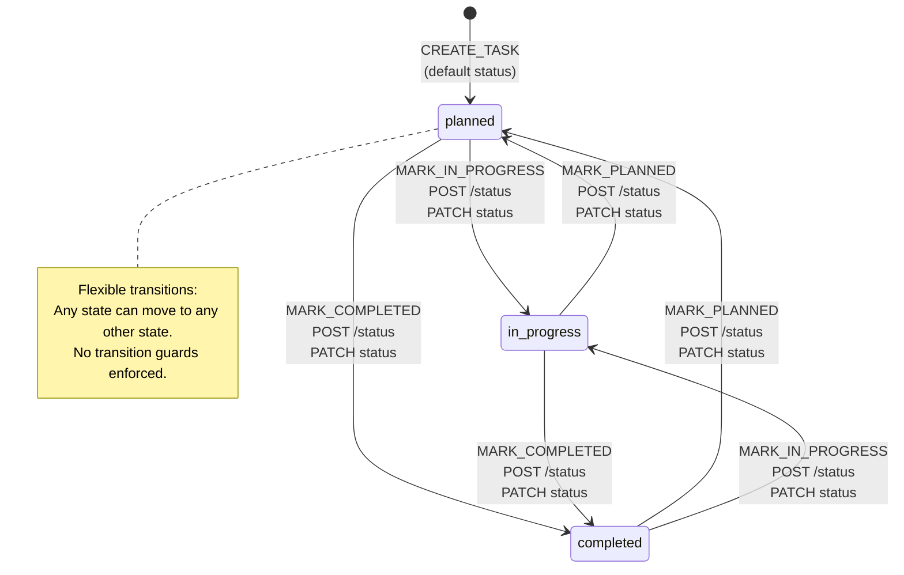

### Design: Flexible vs Strict

The implementation uses a **flexible state machine** — all transitions between the three states are permitted. This supports real-world corrections (e.g., marking a completed task back to in-progress).

| Model | This Project | Alternative (not used) |
|-------|--------------|------------------------|
| Transitions | All 6 bidirectional transitions allowed | Linear only: planned → in_progress → completed |
| Guards | None | Role-based or workflow rules |
| Same-state | Allowed by API; UI hides current-state button | Rejected with 409 Conflict |

---

## Events

| Event | Trigger | API Endpoint | Activity Log |
|-------|---------|--------------|--------------|
| `CREATE_TASK` | User submits create form | `POST /api/tasks` | `created` |
| `MARK_IN_PROGRESS` | "Mark In Progress" button | `POST /api/tasks/:id/status` | `status_changed` |
| `MARK_COMPLETED` | "Mark Completed" button | `POST /api/tasks/:id/status` | `status_changed` |
| `MARK_PLANNED` | "Mark Planned" button | `POST /api/tasks/:id/status` | `status_changed` |
| `UPDATE_TASK` | Edit form submit (may include status) | `PATCH /api/tasks/:id` | `updated` or `status_changed` |
| `UPDATE_STATUS_VIA_PATCH` | Status field changed in edit form | `PATCH /api/tasks/:id` | `status_changed` if status differs |

### Event Flow — Quick Status Change

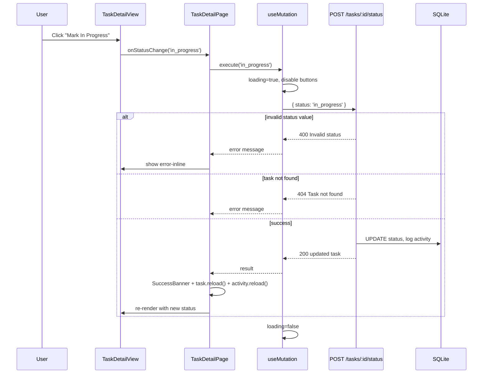

---

## Transitions

### Transition Table

| From State | Event | To State | Allowed | UI Button Visible |
|------------|-------|----------|---------|-------------------|
| `planned` | MARK_IN_PROGRESS | `in_progress` | ✅ | "Mark In Progress" |
| `planned` | MARK_COMPLETED | `completed` | ✅ | "Mark Completed" |
| `planned` | MARK_PLANNED | `planned` | ✅ (no-op) | Hidden (already planned) |
| `in_progress` | MARK_PLANNED | `planned` | ✅ | "Mark Planned" |
| `in_progress` | MARK_COMPLETED | `completed` | ✅ | "Mark Completed" |
| `in_progress` | MARK_IN_PROGRESS | `in_progress` | ✅ (no-op) | Hidden |
| `completed` | MARK_PLANNED | `planned` | ✅ | "Mark Planned" |
| `completed` | MARK_IN_PROGRESS | `in_progress` | ✅ | "Mark In Progress" |
| `completed` | MARK_COMPLETED | `completed` | ✅ (no-op) | Hidden |
| `[*]` | CREATE_TASK | `planned` | ✅ | — (default) |
| `[*]` | CREATE_TASK | `in_progress` | ✅ | — (if status set on create) |
| `[*]` | CREATE_TASK | `completed` | ✅ | — (if status set on create) |

### Transition Implementation

**Server (`POST /api/tasks/:id/status`):**
```typescript
// Validates enum only — no transition guards
if (!['planned', 'in_progress', 'completed'].includes(status)) {
  res.status(400).json({ error: 'Invalid status...' });
  return;
}
db.prepare("UPDATE project_tasks SET status = ?, updated_at = datetime('now') WHERE id = ?")
  .run(status, id);
logActivity(id, 'status_changed', `Status changed from ${existing.status} to ${status}`);
```

**Client (`TaskDetailView`):**
```typescript
// Hides button for current status only (UX, not enforcement)
{task.status !== 'in_progress' && (
  <button onClick={() => onStatusChange('in_progress')}>Mark In Progress</button>
)}
```

---

## Invalid Transitions & Rejections

The state machine does **not** enforce transition rules. Instead, the following are rejected:

### Rejected: Invalid Status Value

| Condition | HTTP | Response | Example |
|-----------|------|----------|---------|
| Status not in enum | 400 | `{ error: "Invalid status. Must be planned, in_progress, or completed." }` | `{ status: "cancelled" }` |
| Status missing from body | 400 | `{ error: "Invalid status..." }` | `{}` |

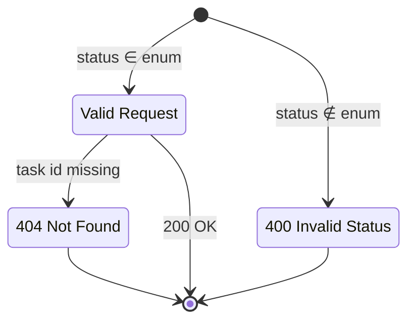

### Rejected: Task Not Found

| Condition | HTTP | Response |
|-----------|------|----------|
| Task ID does not exist | 404 | `{ error: "Task not found" }` |
| Task ID is not a number | 400 | `{ error: "Invalid task ID" }` |

### Rejected: Validation Errors (PATCH / POST create)

| Condition | HTTP | Response |
|-----------|------|----------|
| Invalid status in PATCH body | 400 | `{ error: "Validation failed", details: { status: [...] } }` |
| Empty PATCH body | 400 | `{ error: "No fields to update" }` |

### Not Rejected (Allowed but Hidden in UI)

| Transition | API | UI |
|------------|-----|-----|
| `planned` → `planned` | ✅ Allowed | Button hidden |
| `completed` → `planned` | ✅ Allowed | Button shown |
| `completed` → `in_progress` | ✅ Allowed | Button shown |

> **Note:** If strict linear transitions were required, the server would need transition guards (e.g., reject `completed` → `planned`). This is intentionally not implemented.

---

## Side Effects on Status Change

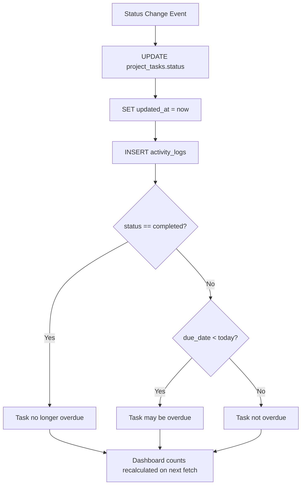

| Side Effect | Description |
|-------------|-------------|
| `updated_at` | Set to current timestamp |
| Activity log | `status_changed` with from/to details |
| Overdue flag | Recomputed: completed tasks never overdue |
| Dashboard `completed` count | Increments/decrements on next `GET /summary` |
| Dashboard `inProgress` count | Updates on next summary fetch |
| Dashboard `overdue` count | May decrease when task marked completed |

---

## 2. Overdue Derived State

Overdue is **not a stored state** — it is computed from `status` and `due_date`.

### Overdue State Diagram

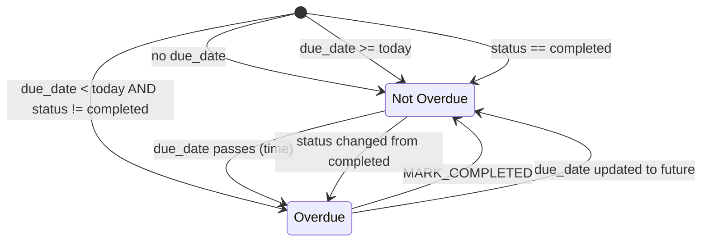

### Overdue Logic

**Server (dashboard count):**
```sql
SELECT COUNT(*) FROM project_tasks
WHERE status != 'completed'
  AND due_date IS NOT NULL
  AND due_date < ?
```

**Client (`isOverdue` helper):**
```typescript
function isOverdue(task): boolean {
  if (!task.dueDate || task.status === 'completed') return false;
  const today = new Date().toISOString().split('T')[0];
  return task.dueDate < today;
}
```

### Overdue UI States

| Context | Visual Indicator |
|---------|------------------|
| Task list item | `.overdue` CSS class, red left border |
| Task detail | "Overdue" badge + red due date text |
| Dashboard count | Included in "Overdue" summary card |

---

## 3. UI Async State Machine (`useAsyncData`)

Governs read operations on every page that fetches data.

### States

| State | `loading` | `data` | `error` | UI Component |
|-------|-----------|--------|---------|--------------|
| **Loading** | `true` | `null` | `null` | `LoadingState` |
| **Success** | `false` | populated | `null` | Page content |
| **Error** | `false` | `null` | message | `ErrorState` |
| **Empty** | `false` | `[]` or empty | `null` | `EmptyState` (page-level) |

### State Diagram

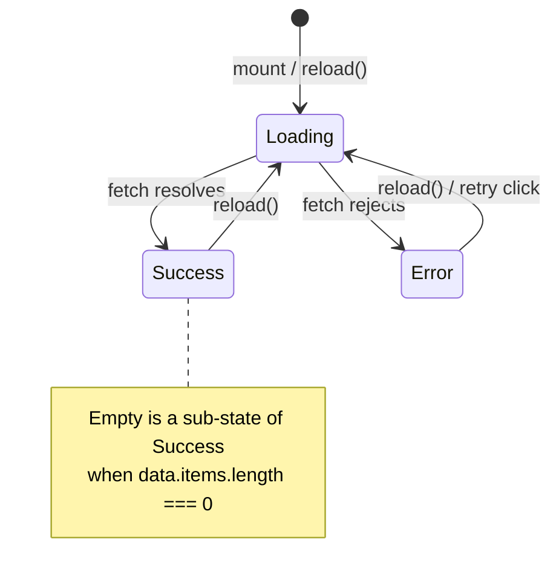

### Transitions

| From | Event | To | Action |
|------|-------|-----|--------|
| `[*]` | Component mount | Loading | `useEffect` calls `reload()` |
| Loading | API success | Success | `setState({ data, loading: false })` |
| Loading | API failure | Error | `setState({ error, loading: false })` |
| Success | `reload()` called | Loading | Clear error, set loading |
| Error | User clicks "Try again" | Loading | `reload()` |
| Error | `reload()` called | Loading | Clear error, set loading |

### Error Sub-States

| Error Type | Source | `validationErrors` |
|------------|--------|-------------------|
| Network failure | `fetch` throws | `null` |
| API error (4xx/5xx) | `ApiRequestError` | May have `details` |
| Invalid task ID | Client-side check | `null` |

---

## 4. UI Mutation State Machine (`useMutation`)

Governs write operations (create, update, status change).

### States

| State | `loading` | `success` | `error` | `validationErrors` |
|-------|-----------|-----------|---------|-------------------|
| **Idle** | `false` | `false` | `null` | `null` |
| **Loading** | `true` | `false` | `null` | `null` |
| **Success** | `false` | `true` | `null` | `null` |
| **Error** | `false` | `false` | message | may be set |
| **Validation Error** | `false` | `false` | message | field map |

### State Diagram

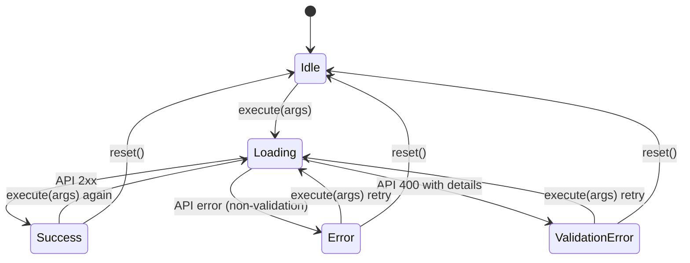

### Mutation Flow by Page

| Page | Mutation | On Success |
|------|----------|------------|
| `CreateTaskPage` | `api.createTask` | Banner → redirect to detail (800ms) |
| `EditTaskPage` | `api.updateTask` | Banner → redirect to detail (800ms) |
| `TaskDetailPage` | `api.updateTaskStatus` | Banner → `task.reload()` + `activity.reload()` |

---

## 5. Page UI State Machine

Each page combines async states into a rendered view.

### Dashboard Page

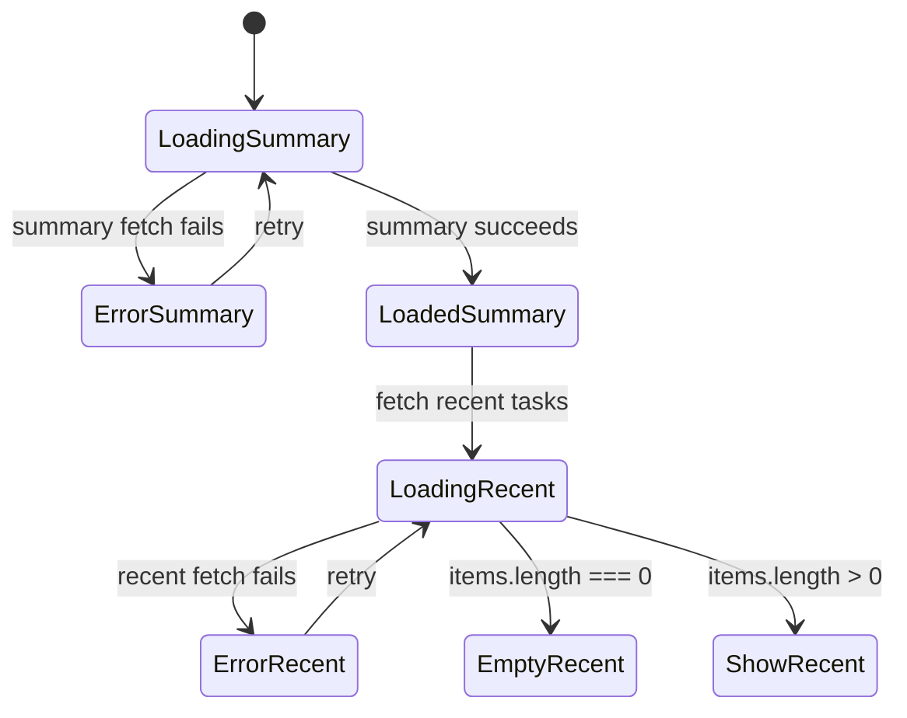

### Tasks Page

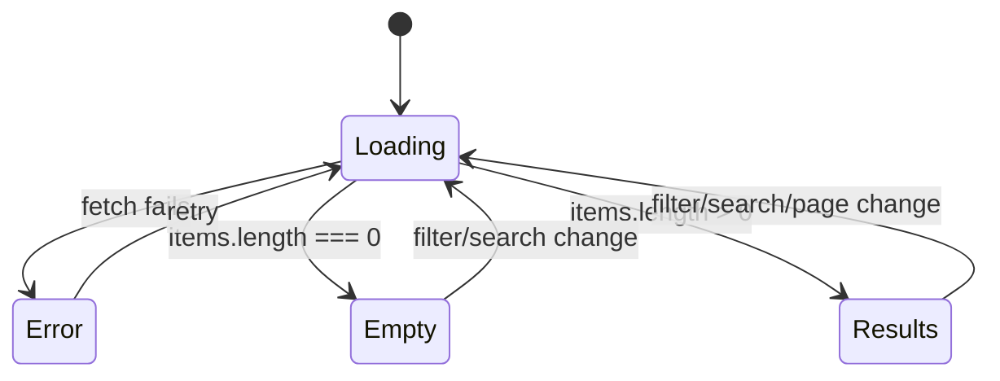

### Task Detail Page

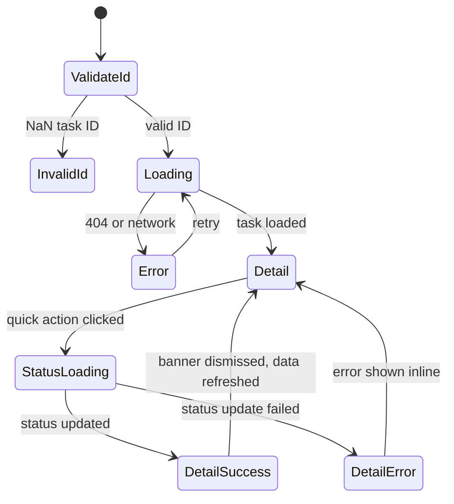

---

## 6. Activity Log Event States

Activity log entries represent **historical events**, not current state.

| Action | Triggered By | Stored In |
|--------|--------------|-----------|
| `created` | `POST /api/tasks` | `activity_logs.action` |
| `updated` | `PATCH /api/tasks/:id` (non-status change) | `activity_logs.action` |
| `status_changed` | `PATCH` or `POST /status` when status differs | `activity_logs.action` |

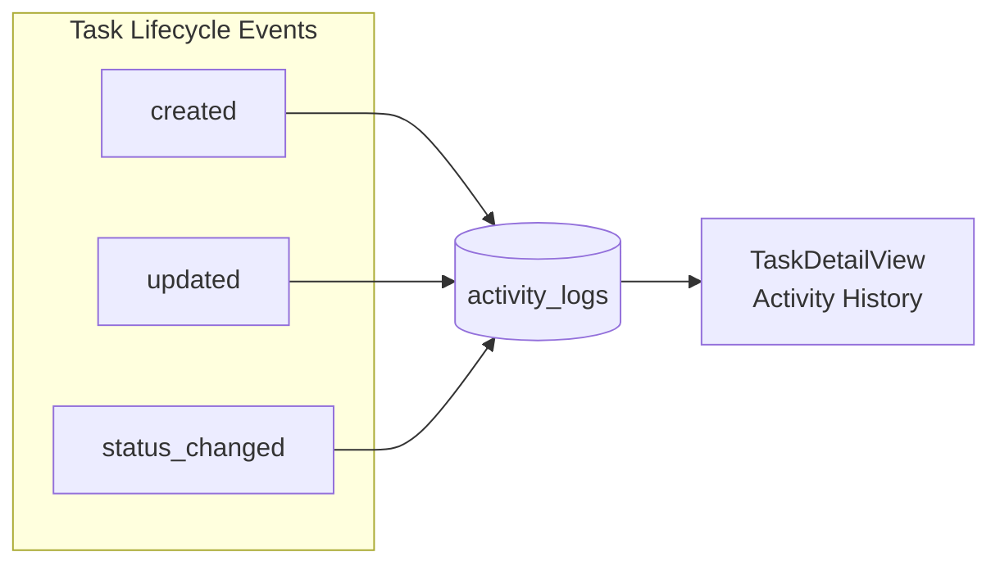

---

## State Machine Summary

```mermaid
flowchart TB
    subgraph Domain["Domain State Machines"]
        TS[Task Status<br/>planned | in_progress | completed]
        OD[Overdue Derived<br/>computed boolean]
    end

    subgraph UI["UI State Machines"]
        AD[useAsyncData<br/>loading | success | error]
        MU[useMutation<br/>idle | loading | success | error]
        PG[Page States<br/>loading | empty | error | content]
    end

    TS --> OD
    TS -->|status change| AL[Activity Log]
    MU -->|on success| AD
    AD --> PG
    MU --> PG
```

---

## Implementation Reference

| State Machine | Primary Files |
|---------------|---------------|
| Task status | `src/server/routes/tasks.ts`, `src/client/components/TaskDetailView.tsx` |
| Overdue | `src/client/types/index.ts` (`isOverdue`), `src/server/routes/dashboard.ts` |
| Async data | `src/client/hooks/useAsyncData.ts` |
| Page UI | `src/client/pages/*.tsx`, `src/client/components/StateMessages.tsx` |
| Schema constraint | `database/schema-or-migrations/schema.sql` (`CHECK status IN (...)`) |

---

## Future Enhancements (Not Implemented)

| Enhancement | Description |
|-------------|-------------|
| Strict transitions | Reject `completed` → `planned` with 409 Conflict |
| Role-based transitions | Only owner can change status |
| `cancelled` state | Fourth terminal state |
| State history table | Full before/after audit beyond activity log |
| Optimistic UI | Update status in UI before API confirms |

---

## Related Documents

- [ARCHITECTURE.md](./ARCHITECTURE.md) — System architecture
- [DESIGN_DECISIONS.md](./DESIGN_DECISIONS.md) — DD-9 Task Status State Machine rationale
- [FUNCTIONAL_REQUIREMENTS.md](./FUNCTIONAL_REQUIREMENTS.md) — FR-2.5 Quick Status Change
- [API.md](./API.md) — Status endpoint specification (Step 6)
