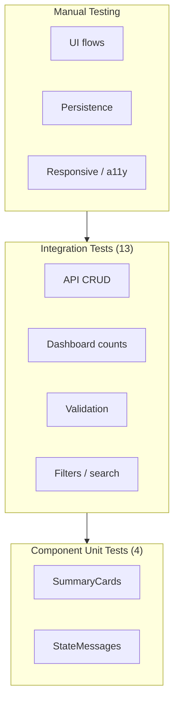
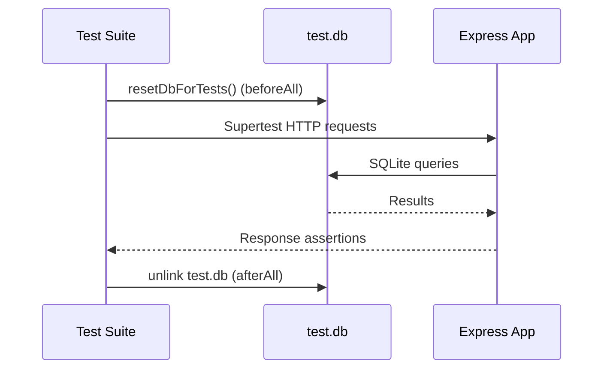
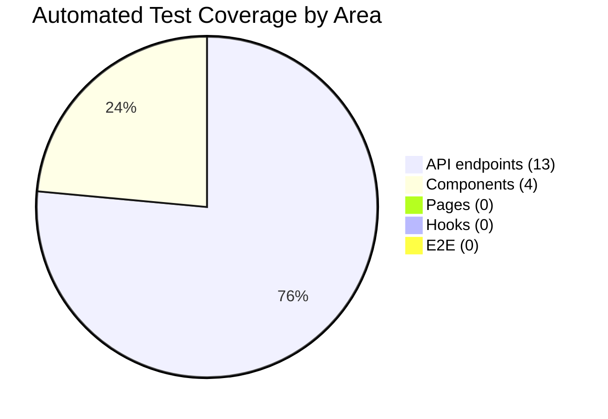

# Testing — AI Learning Dashboard / Project Tracker

Testing strategy, coverage, and verification documentation for the **current implementation**.

---

## Overview

| Property | Value |
|----------|-------|
| **Test runner** | Vitest 2.1.x |
| **API testing** | Supertest + Express app export |
| **Component testing** | @testing-library/react + jsdom |
| **Type checking** | `npm run lint` (tsc --noEmit) |
| **Total automated tests** | 17 (13 API + 4 component) |
| **Test database** | `database/test.db` (isolated, ephemeral) |

---

## Test Pyramid



| Level | Count | Tool | Location |
|-------|-------|------|----------|
| Component unit | 4 | Vitest + Testing Library | `tests/client/` |
| API integration | 13 | Vitest + Supertest | `tests/api/` |
| Manual | 9+ scenarios | Browser | Checklist below |
| E2E | 0 | — | Deferred |

---

## Running Tests

### Commands

```bash
# Run all tests once
npm test

# Watch mode (re-run on file change)
npm run test:watch

# Type check only
npm run lint

# Run API tests only
npx vitest run tests/api/tasks.test.ts --no-file-parallelism

# Run component tests only
npx vitest run tests/client/components.test.tsx --no-file-parallelism
```

### Expected Output

```
✓ tests/api/tasks.test.ts (13 tests)
✓ tests/client/components.test.tsx (4 tests)

Tests: 17 passed
```

### Known Issue: Vitest Worker Teardown

Vitest may exit with code 1 due to a `RangeError: Maximum call stack size exceeded` during worker pool teardown **after all tests pass**. This is a known Vitest/tinypool issue in this environment.

**Mitigation applied:**
- `--no-file-parallelism` in `package.json` test script
- `pool: 'forks'` with `singleFork: true` in `vitest.config.ts`

**Verification:** All 17 test assertions pass before teardown error occurs.

---

## Test Configuration

### Vitest (`vitest.config.ts`)

| Setting | Value | Purpose |
|---------|-------|---------|
| `environment` | `node` (default) | API tests run in Node |
| `environmentMatchGlobs` | `tests/client/**` → `jsdom` | DOM for React components |
| `globals` | `true` | `vi.fn()` without import |
| `setupFiles` | `tests/setup.ts` | jest-dom matchers |
| `pool` | `forks` | Process isolation |
| `singleFork` | `true` | Avoid SQLite concurrency issues |

### Test Setup (`tests/setup.ts`)

```typescript
import '@testing-library/jest-dom/vitest';
```

Enables matchers: `toBeInTheDocument()`, `toHaveTextContent()`, etc.

### Database Isolation (`tests/api/tasks.test.ts`)

```typescript
process.env.NODE_ENV = 'test';
process.env.DATABASE_PATH = path.join(process.cwd(), 'database', 'test.db');

beforeAll(() => resetDbForTests());   // Fresh schema + seed
afterAll(() => {
  closeDb();
  fs.unlinkSync(testDb);              // Clean up test file
});
```

---

## Integration Tests (API)

**File:** `tests/api/tasks.test.ts`  
**Tool:** Vitest + Supertest  
**Database:** Isolated `database/test.db` with seed data

### Test Suites

#### Dashboard API (1 test)

| Test | Endpoint | Assertions |
|------|----------|------------|
| Returns correct counts | `GET /api/dashboard/summary` | 200 status; all 5 count fields present; `total > 0`; `completed + inProgress ≤ total` |

#### Tasks API (10 tests)

| Test | Endpoint | Assertions |
|------|----------|------------|
| Returns paginated list | `GET /api/tasks` | 200; `items` array; `total`, `page` present |
| Filters by status | `GET /api/tasks?status=completed` | All items have `status === 'completed'` |
| Searches by keyword | `GET /api/tasks?search=React` | At least 1 result (seed task #1) |
| Creates task | `POST /api/tasks` | 201; title matches; `id` defined |
| Rejects missing title | `POST /api/tasks` (no title) | 400; `error === 'Validation failed'` |
| Returns task detail | `GET /api/tasks/1` | 200; `id === 1`; `owner` defined |
| Returns 404 for missing | `GET /api/tasks/99999` | 404 |
| Updates task fields | `PATCH /api/tasks/:id` | 200; title and priority updated |
| Changes status | `POST /api/tasks/:id/status` | 200; `status === 'in_progress'` |
| Returns activity log | `GET /api/tasks/1/activity` | 200; array response |

#### Users API (1 test)

| Test | Endpoint | Assertions |
|------|----------|------------|
| Returns seeded users | `GET /api/users` | 200; array length > 0; `name`, `email` on first item |

#### Dashboard Count Sync (1 test)

| Test | Flow | Assertions |
|------|------|------------|
| Completed count increases | GET summary → POST create (in_progress) → POST status (completed) → GET summary | `after.completed === before.completed + 1` |

### API Test Flow Diagram



---

## Unit Tests (Components)

**File:** `tests/client/components.test.tsx`  
**Tool:** Vitest + @testing-library/react + jsdom

### SummaryCards (1 test)

| Test | Input | Assertions |
|------|-------|------------|
| Renders all five cards | `{ total: 8, completed: 2, inProgress: 3, overdue: 1, highPriority: 3 }` | Labels: Total Items, Completed, In Progress, Overdue, High Priority; values: 8, 2, 3, 1, 3 |

### StateMessages (3 tests)

| Component | Test | Assertions |
|-----------|------|------------|
| `LoadingState` | Shows spinner and message | `role="status"` contains "Loading tasks..." |
| `EmptyState` | Shows title and description | Title and description text visible |
| `ErrorState` | Shows error and retry | `role="alert"` contains message; "Try again" calls `onRetry` |

### Components Not Yet Tested

| Component | Reason Deferred |
|-----------|-----------------|
| `TaskForm` | Requires user event simulation + mock API |
| `TaskList` | Requires React Router wrapper |
| `TaskDetailView` | Requires mock task data + callbacks |
| `TaskFiltersBar` | Requires user event simulation |
| `Layout` | Requires React Router |
| Page components | Integration complexity; covered by manual testing |

---

## Manual Testing

### Core Flow Checklist

| # | Scenario | Steps | Expected Result | AC |
|---|----------|-------|-----------------|-----|
| M-1 | Create task (full) | Fill all fields → Create | Task appears in list + dashboard | AC-1 |
| M-2 | Create task (no title) | Submit empty title | Inline validation error | AC-9 |
| M-3 | Search tasks | Type "React" in search | Filtered results | AC-7 |
| M-4 | Filter by status | Select "Completed" | Only completed tasks | AC-7 |
| M-5 | Mark completed | Detail → Mark Completed | Status updates, count increases | AC-6, AC-2 |
| M-6 | Overdue indicator | View task #6 (seed) | Red border + Overdue badge | AC-3 |
| M-7 | Data persistence | Create task → restart server | Task still exists | AC-8 |
| M-8 | Edit task | Edit → change title → Save | Updated on detail page | AC-5 |
| M-9 | Activity log | Create/update/status change | New entries in activity section | AC-11 |

### UI State Checklist

| Page | Loading | Empty | Error | Success |
|------|---------|-------|-------|---------|
| Dashboard | Spinner on load | "No tasks yet" CTA | Retry button | Cards + list |
| Tasks | Spinner on load | "No tasks found" | Retry button | Filtered list |
| Task Detail | Spinner on load | N/A | Error + back link | Full detail |
| Create Task | Form loading | N/A | Error banner | Success → redirect |
| Edit Task | Form loading | N/A | Error banner | Success → redirect |

### Accessibility Checklist

| # | Check | How to Verify |
|---|-------|---------------|
| A-1 | Skip link | Tab on page load → "Skip to main content" appears |
| A-2 | Form labels | All inputs have visible labels |
| A-3 | ARIA on errors | Invalid fields have `aria-invalid` |
| A-4 | Alert roles | Error messages have `role="alert"` |
| A-5 | Keyboard nav | Tab through form fields and buttons |
| A-6 | Mobile layout | Resize to 375px → stacked layout |

### Responsive Checklist

| Breakpoint | Verify |
|------------|--------|
| ≤768px | Header stacks, filters full-width |
| ≤480px | Summary cards single column |

---

## Edge Cases

### API Edge Cases

| Edge Case | Test Coverage | Manual |
|-----------|---------------|--------|
| Missing title on create | ✅ Automated | — |
| Invalid task ID (non-numeric) | ❌ Not automated | ✅ Manual |
| Task not found (404) | ✅ Automated | — |
| Empty PATCH body | ❌ Not automated | ✅ Manual |
| Invalid status value | ❌ Not automated | ✅ Manual |
| Invalid owner ID | ❌ Not automated | ✅ Manual |
| Search with no results | ❌ Not automated | ✅ Manual |
| Pagination beyond last page | ❌ Not automated | ✅ Manual |
| Completed task with past due date | ❌ Not automated | ✅ Manual (not overdue) |
| Task with null due date | ❌ Not automated | ✅ Manual (shows "—") |
| Limit > 100 (clamped) | ❌ Not automated | ✅ Manual |
| Concurrent status changes | ❌ Not tested | N/A (single user) |

### UI Edge Cases

| Edge Case | Test Coverage | Manual |
|-----------|---------------|--------|
| API unreachable | ❌ Not automated | ✅ Manual (ErrorState) |
| Very long title (200 chars) | ❌ Not automated | ✅ Manual |
| Empty description | ❌ Not automated | ✅ Manual |
| Filter + search combined | ❌ Not automated | ✅ Manual |
| Page reset on filter change | ❌ Not automated | ✅ Manual |
| Debounced search (300ms) | ❌ Not automated | ✅ Manual |

---

## Validation Matrix

Maps input validation rules to test coverage.

### Create Task (`POST /api/tasks`)

| Field | Rule | API Test | Component Test | Manual |
|-------|------|----------|----------------|--------|
| title | Required, 1–200 chars | ✅ Missing title | ❌ | ✅ |
| title | Max 200 chars | ❌ | ❌ | ✅ |
| description | Max 2000 chars | ❌ | ❌ | ✅ |
| category | Required enum | ❌ | ❌ | ✅ |
| priority | Required enum | ❌ | ❌ | ✅ |
| status | Optional enum, default planned | ❌ | ❌ | ✅ |
| ownerId | Required, positive int | ❌ | ❌ | ✅ |
| ownerId | Must exist in users | ❌ | ❌ | ✅ |
| dueDate | Optional, YYYY-MM-DD | ❌ | ❌ | ✅ |

### Update Task (`PATCH /api/tasks/:id`)

| Field | Rule | API Test | Manual |
|-------|------|----------|--------|
| Any field | Partial update | ✅ Title + priority | ✅ |
| Empty body | Rejected 400 | ❌ | ✅ |
| status | Valid enum | ❌ | ✅ |
| ownerId | Must exist | ❌ | ✅ |

### Status Change (`POST /api/tasks/:id/status`)

| Field | Rule | API Test | Manual |
|-------|------|----------|--------|
| status | Required enum | ✅ in_progress | ✅ completed, planned |
| status | Invalid value → 400 | ❌ | ✅ |

### Query Parameters (`GET /api/tasks`)

| Param | Rule | API Test | Manual |
|-------|------|----------|--------|
| status | Filter exact match | ✅ completed | ✅ |
| search | LIKE title/description | ✅ React | ✅ |
| priority | Filter exact match | ❌ | ✅ |
| category | Filter exact match | ❌ | ✅ |
| ownerId | Filter exact match | ❌ | ✅ |
| sortBy | Column mapping | ❌ | ✅ |
| page | Min 1 | ❌ | ✅ |
| limit | 1–100 clamped | ❌ | ✅ |

---

## Acceptance Criteria Test Mapping

| AC | Description | Automated | Manual |
|----|-------------|-----------|--------|
| AC-1 | Create task | ✅ POST create | ✅ Full flow |
| AC-2 | Dashboard summary | ✅ Summary + count sync | ✅ Visual |
| AC-3 | List tasks | ✅ GET list | ✅ Click to detail |
| AC-4 | View detail | ✅ GET by id | ✅ Quick actions |
| AC-5 | Update task | ✅ PATCH | ✅ Edit form |
| AC-6 | Status changes | ✅ POST status | ✅ Buttons |
| AC-7 | Search/filter | ✅ Status + search | ✅ All filters |
| AC-8 | Persistence | ❌ | ✅ Server restart |
| AC-9 | Validation | ✅ Missing title | ✅ Field errors |
| AC-10 | UI states | ✅ StateMessages | ✅ All pages |
| AC-11 | Activity log | ✅ GET activity | ✅ Detail view |
| AC-12 | Advanced filters | ❌ | ✅ Priority, sort, pagination |
| AC-13 | Accessible | ❌ | ✅ Skip link, ARIA |
| AC-14 | Tests exist | ✅ 17 tests | — |

---

## Test Coverage Plan

### Current Coverage



| Area | Files | Tests | Coverage Estimate |
|------|-------|-------|-------------------|
| API routes | 3 route files | 13 | ~75% of endpoints/scenarios |
| Components | 2 of 7 | 4 | ~30% of components |
| Hooks | 0 of 1 | 0 | 0% |
| Pages | 0 of 5 | 0 | 0% |
| Validators | 0 | 0 | 0% (tested via API) |

### Priority 1 — High Value (Recommended Next)

| Test | File | Rationale |
|------|------|-----------|
| Invalid status POST | `tasks.test.ts` | Common error path |
| Invalid owner ID | `tasks.test.ts` | Validation boundary |
| Empty PATCH body | `tasks.test.ts` | Edge case |
| GET /api/health | `tasks.test.ts` | Health endpoint |
| `TaskForm` submit | `components.test.tsx` | Core user interaction |

### Priority 2 — Medium Value

| Test | File | Rationale |
|------|------|-----------|
| Filter by priority/category | `tasks.test.ts` | Stretch AC-12 |
| Pagination bounds | `tasks.test.ts` | Edge case |
| `useAsyncData` hook | `hooks.test.ts` | State management |
| `useMutation` hook | `hooks.test.ts` | Error/validation handling |
| `TaskList` rendering | `components.test.tsx` | List display |

### Priority 3 — Lower Value / Deferred

| Test | Tool | Rationale |
|------|------|-----------|
| E2E create → list → update | Playwright | Time-intensive setup |
| Load testing | k6/Artillery | Out of assessment scope |
| Cross-browser | BrowserStack | Manual sufficient |
| Auth flows | — | Not implemented |

### Target Coverage Goals

| Metric | Current | Target (Assessment) | Target (Production) |
|--------|---------|---------------------|---------------------|
| API endpoint scenarios | 13 | 18+ | 30+ |
| Component tests | 4 | 8+ | 20+ |
| Page tests | 0 | 2+ | 10+ |
| E2E flows | 0 | 0 (deferred) | 5+ |
| Manual checklist | 9 | 9 ✅ | 15+ |

---

## CI/CD Recommendation

```yaml
name: CI

on: [push, pull_request]

jobs:
  test:
    runs-on: ubuntu-latest
    steps:
      - uses: actions/checkout@v4
      - uses: actions/setup-node@v4
        with:
          node-version: '20'
      - run: npm ci
      - run: npm run lint
      - run: npm test
        env:
          NODE_ENV: test
```

**Notes:**
- `npm test` may report exit code 1 due to Vitest teardown — consider `|| true` with assertion grep, or upgrade Vitest
- No database service needed (SQLite file-based)
- `database/test.db` created and destroyed per run

---

## Test Data

### Seed Data Used in Tests

Tests run against the same seed data as development:

| Entity | Count | Notable Records |
|--------|-------|-----------------|
| Users | 4 | IDs 1–4 |
| Tasks | 8 | Task #1 has "React" in title; Task #6 is overdue |
| Activity logs | 5 | Task #1 has 2 entries |

### Test-Created Data

API tests create additional tasks during execution:
- "Test Task" (create validation test)
- "Update Me" → "Updated Title" (PATCH test)
- "Status Test" (status change test)
- "Complete Me" (dashboard count sync test)

These persist within the test suite but are destroyed when `test.db` is deleted in `afterAll`.

---

## Debugging Test Failures

| Symptom | Likely Cause | Fix |
|---------|--------------|-----|
| Tests pass but exit code 1 | Vitest worker teardown | Known issue; verify tests passed in output |
| Intermittent failures | Shared database state | Ensure `resetDbForTests()` in `beforeAll` |
| 404 on all API tests | Server not exported | Check `export default app` in `index.ts` |
| Component test DOM errors | Wrong environment | Verify `environmentMatchGlobs` for `tests/client/**` |
| `owner` undefined | JOIN missing | Check task route SQL includes users JOIN |
| Search test fails | Seed data missing | Verify seed task #1 contains "React" |

### Useful Commands

```bash
# Verbose test output
npx vitest run --reporter=verbose

# Single test by name
npx vitest run -t "creates a task"

# Inspect test database
sqlite3 database/test.db "SELECT * FROM project_tasks;"
```

---

## Test Results Log

| Date | Command | API Tests | Component Tests | Lint | Notes |
|------|---------|-----------|-----------------|------|-------|
| 2026-07-06 | `npm test` | 13 ✅ | 4 ✅ | ✅ | Documented in `test-results.md` |
| 2026-07-20 | `npm test` | 13 ✅ | 4 ✅ | — | Vitest teardown stack overflow (tests pass) |

---

## Related Documents

- [ACCEPTANCE_CRITERIA.md](./ACCEPTANCE_CRITERIA.md) — Testable criteria checklist
- [API.md](./API.md) — Endpoint specifications for test design
- [FUNCTIONAL_REQUIREMENTS.md](./FUNCTIONAL_REQUIREMENTS.md) — Feature specs
- [NON_FUNCTIONAL_REQUIREMENTS.md](./NON_FUNCTIONAL_REQUIREMENTS.md) — NFR-5 Testability
- `test-strategy.md` — Original test strategy (repository root)
- `test-results.md` — Latest test run results (repository root)
