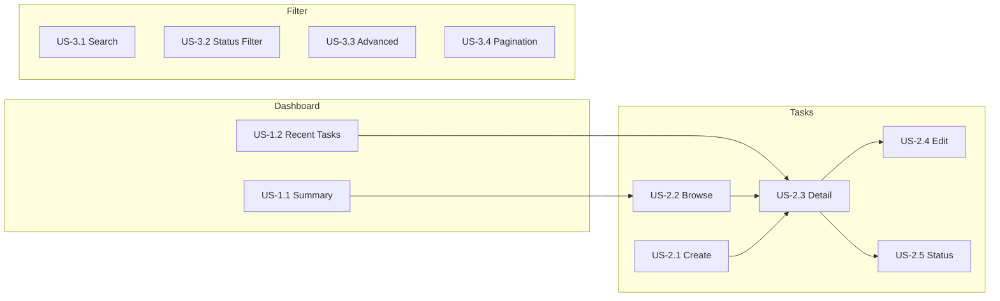

# User Stories — AI Learning Dashboard / Project Tracker

## Personas

| Persona | Description |
|---------|-------------|
| **Learner** | Tracks personal learning goals (courses, practice, research) |
| **Project Member** | Manages assigned project tasks with due dates and priorities |
| **Viewer** | Reviews task progress on the dashboard (read-only intent; no RBAC enforcement) |

> **Note:** All personas share the same unauthenticated access. User roles (`admin`, `member`, `viewer`) are stored for ownership display only.

---

## Epic 1: Dashboard Overview

### US-1.1 — View Dashboard Summary

**As a** learner,  
**I want to** see summary cards for total, completed, in-progress, overdue, and high-priority tasks,  
**So that** I can quickly understand my overall progress at a glance.

**Acceptance mapping:** AC-2

**Implementation:**
- Route: `/` (`DashboardPage`)
- API: `GET /api/dashboard/summary`
- Component: `SummaryCards`

---

### US-1.2 — View Recent Tasks on Dashboard

**As a** learner,  
**I want to** see my most recently created tasks on the dashboard,  
**So that** I can jump back into active work without navigating to the full list.

**Acceptance mapping:** AC-2, AC-3

**Implementation:**
- API: `GET /api/tasks?limit=5&sortBy=createdAt&sortOrder=desc`
- Component: `TaskList` (subset)

---

## Epic 2: Task Management

### US-2.1 — Create a New Task

**As a** project member,  
**I want to** create a task with title, description, category, priority, status, owner, and due date,  
**So that** I can track a new learning goal or project item.

**Acceptance mapping:** AC-1, AC-8, AC-9

**Implementation:**
- Route: `/tasks/new` (`CreateTaskPage`)
- API: `POST /api/tasks`
- Component: `TaskForm`

**Story details:**
- Required fields: title, category, priority, owner
- On success: green banner → redirect to task detail after 800ms
- On validation failure: inline field errors from server

---

### US-2.2 — Browse All Tasks

**As a** learner,  
**I want to** view a list of all tasks with key metadata,  
**So that** I can scan everything I'm tracking.

**Acceptance mapping:** AC-3

**Implementation:**
- Route: `/tasks` (`TasksPage`)
- API: `GET /api/tasks`
- Component: `TaskList`

**Displayed per task:** title, status badge, priority, category, owner name, due date, overdue indicator

---

### US-2.3 — View Task Details

**As a** learner,  
**I want to** open a task and see all its details,  
**So that** I can review the full context before taking action.

**Acceptance mapping:** AC-4

**Implementation:**
- Route: `/tasks/:id` (`TaskDetailPage`)
- API: `GET /api/tasks/:id`, `GET /api/tasks/:id/activity`
- Component: `TaskDetailView`

---

### US-2.4 — Edit a Task

**As a** project member,  
**I want to** update any field on an existing task,  
**So that** I can keep task information current.

**Acceptance mapping:** AC-5, AC-9

**Implementation:**
- Route: `/tasks/:id/edit` (`EditTaskPage`)
- API: `PATCH /api/tasks/:id`
- Component: `TaskForm` (pre-populated)

---

### US-2.5 — Quick Status Change

**As a** learner,  
**I want to** mark a task as in-progress or completed with one click,  
**So that** I can update progress without opening the full edit form.

**Acceptance mapping:** AC-6, AC-11

**Implementation:**
- Route: `/tasks/:id` (quick action buttons)
- API: `POST /api/tasks/:id/status`
- Activity logged automatically

---

## Epic 3: Search and Filter

### US-3.1 — Search Tasks by Keyword

**As a** learner,  
**I want to** search tasks by title or description,  
**So that** I can quickly find a specific item.

**Acceptance mapping:** AC-7

**Implementation:**
- Component: `TaskFiltersBar` search input
- API: `GET /api/tasks?search=<keyword>`
- Debounced 300ms before API call

---

### US-3.2 — Filter Tasks by Status

**As a** learner,  
**I want to** filter tasks by status (planned, in-progress, completed),  
**So that** I can focus on tasks in a specific state.

**Acceptance mapping:** AC-7

**Implementation:**
- API: `GET /api/tasks?status=<value>`

---

### US-3.3 — Advanced Filtering and Sorting (Stretch)

**As a** project member,  
**I want to** filter by priority, category, and owner, and sort by due date, priority, created date, or title,  
**So that** I can organize tasks the way I work.

**Acceptance mapping:** AC-12

**Implementation:**
- Component: `TaskFiltersBar`
- API query params: `priority`, `category`, `ownerId`, `sortBy`, `sortOrder`

---

### US-3.4 — Paginate Task Results (Stretch)

**As a** learner,  
**I want to** page through large task lists,  
**So that** the page remains fast and readable.

**Acceptance mapping:** AC-12

**Implementation:**
- 10 items per page on Tasks page
- Previous/Next controls when `totalPages > 1`

---

## Epic 4: Activity and Audit (Stretch)

### US-4.1 — View Task Activity History

**As a** project member,  
**I want to** see a history of changes made to a task,  
**So that** I can understand what happened and when.

**Acceptance mapping:** AC-11

**Implementation:**
- API: `GET /api/tasks/:id/activity`
- Displayed in `TaskDetailView` activity section
- Events: `created`, `updated`, `status_changed`

---

## Epic 5: System Behavior

### US-5.1 — Data Persistence

**As a** user,  
**I want** my tasks to remain after restarting the server,  
**So that** I don't lose my progress.

**Acceptance mapping:** AC-8

**Implementation:**
- SQLite file at `database/app.db`
- WAL journal mode for durability

---

### US-5.2 — Graceful Error Handling

**As a** user,  
**I want** clear feedback when something goes wrong,  
**So that** I know what happened and can retry.

**Acceptance mapping:** AC-10

**Implementation:**
- Components: `ErrorState`, `error-inline`, `SuccessBanner`, `LoadingState`, `EmptyState`

---

### US-5.3 — Accessible Interface (Stretch)

**As a** user with assistive technology,  
**I want** the application to be keyboard-navigable and screen-reader friendly,  
**So that** I can use it effectively.

**Acceptance mapping:** AC-13

**Implementation:**
- Skip-to-content link
- ARIA labels on filters, pagination, status actions
- Form labels associated with inputs
- `role="alert"` on error messages

---

## Story Map

---

## Story Priority Matrix

| Priority | Stories |
|----------|---------|
| **P0 — Must Have** | US-1.1, US-2.1, US-2.2, US-2.3, US-2.4, US-2.5, US-3.1, US-3.2, US-5.1, US-5.2 |
| **P1 — Should Have** | US-1.2, US-3.3, US-3.4, US-4.1, US-5.3 |
| **P2 — Won't Have (this release)** | Authentication, notifications, attachments |
